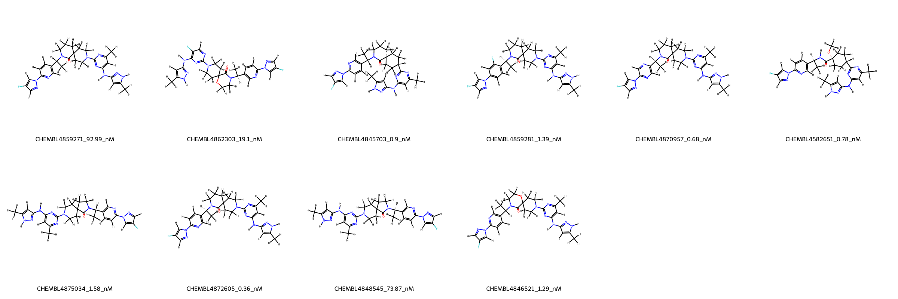

# RET System FEP Calculation Results Analysis

> This README is generated by AI model using verified experimental data and Uni-FEP calculation results. Content may contain inaccuracies and is provided for reference only. No liability is assumed for outcomes related to its use.

## Introduction

RET is a receptor tyrosine kinase that plays a crucial role in various cellular processes, including neural and renal development, as well as survival and proliferation of neuroendocrine cells. Dysregulation of RET signaling, often through point mutations and chromosomal rearrangements, has been implicated in multiple pathologies, including inherited cancer syndromes such as multiple endocrine neoplasia type 2 (MEN2) and sporadic cancers like medullary thyroid carcinoma and non-small cell lung cancer. The RET kinase is a validated therapeutic target, with multiple selective inhibitors approved or in development for the treatment of RET-altered cancers. 

## Molecules

The RET system dataset in this study consists of 11 compounds, demonstrating a range of structural and chemical diversity. The compounds include various modifications in key substituents, contributing to their distinct binding affinity towards RET.  

The experimentally determined binding free energies (ΔG) span a wide range, from -9.588 kcal/mol to -12.8771 kcal/mol, reflecting significant potency variation among the compounds. These molecules exhibited a notable diversity in binding properties, with predictions aligning well with experimental trends.

## Conclusions

The FEP calculation results for the RET system show solid agreement with experimental data, achieving an R² of 0.60 and an RMSE of 1.21 kcal/mol. Several compounds highlighted excellent prediction accuracy. For instance, CHEMBL4872605 demonstrated a close match between experimental and calculated binding free energies (-12.8771 kcal/mol and -13.3598 kcal/mol, respectively). Similarly, compounds such as CHEMBL4875034 and CHEMBL4846521 showcased strong concordance between predicted and experimental affinities.

The results elucidate the accuracy and utility of the FEP calculations in capturing binding free energy trends across this diverse dataset.

## References

For more information about the RET target and associated bioactivity data, please visit:
https://www.ebi.ac.uk/chembl/explore/target/CHEMBL4836452 