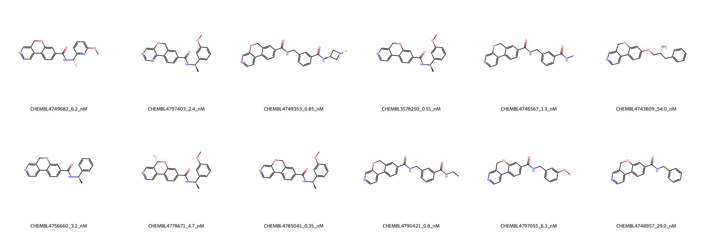

# ROCK2 System FEP Calculation Results Analysis

> This README is generated by AI model using verified experimental data and Uni-FEP calculation results. Content may contain inaccuracies and is provided for reference only. No liability is assumed for outcomes related to its use.

## Introduction

ROCK2 (Rho-associated protein kinase 2) is a serine/threonine kinase that plays crucial roles in various cellular processes, including stress fiber formation, smooth muscle contraction, cell adhesion, and cell motility. As a key effector of the small GTPase RhoA, ROCK2 has emerged as an important therapeutic target for various diseases, including cardiovascular disorders, cancer, and fibrotic diseases.

## Molecules

The ROCK2 system dataset consists of 12 compounds sharing a common benzofuro[3,2-c]pyridine or benzoxazino[3,2-c]pyridine scaffold. These compounds demonstrate structural diversity through variations in their amide substituents, including different alkyl groups and methoxy-substituted phenyl rings. The core structure features a fused tricyclic system that serves as a key recognition element for binding to the ROCK2 kinase domain.

The experimental binding affinities span two orders of magnitude, ranging from 0.35 nM to 54 nM, corresponding to binding free energies from -9.91 to -12.89 kcal/mol. The most potent compounds (e.g., CHEMBL4785041 and CHEMBL3578250) feature optimally positioned methoxy-substituted phenyl rings in their amide substituents.

## Conclusions

The FEP calculations for the ROCK2 system showed moderate correlation with experimental data, achieving an R² of 0.38 and an RMSE of 1.14 kcal/mol. Several compounds demonstrated good prediction accuracy, such as CHEMBL4785041 (experimental: -12.89 kcal/mol, predicted: -12.75 kcal/mol) and CHEMBL4790421 (experimental: -12.40 kcal/mol, predicted: -12.53 kcal/mol). The predictions were particularly accurate for compounds with similar core structures and substituent patterns.

## References

For more information about the ROCK2 target and associated bioactivity data, please visit:
https://www.ebi.ac.uk/chembl/explore/assay/CHEMBL4669834 