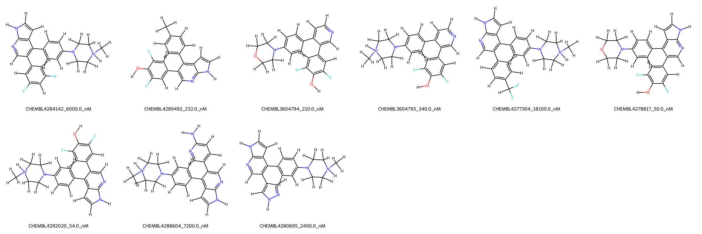
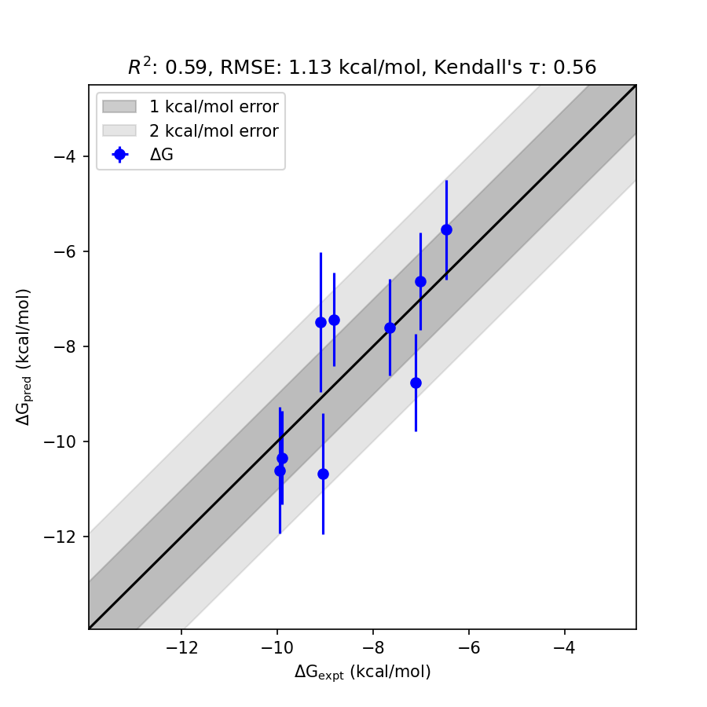

# RPS6KA3 System FEP Calculation Results Analysis  

> This README is generated by AI model using verified experimental data and Uni-FEP calculation results. Content may contain inaccuracies and is provided for reference only. No liability is assumed for outcomes related to its use.  

## Introduction  

RPS6KA3 (ribosomal protein S6 kinase alpha-3), also known as RSK2 (90 kDa ribosomal S6 kinase 2), is a serine/threonine protein kinase belonging to the RSK (ribosomal S6 kinase) family. It is regulated by extracellular signal-regulated kinases (ERKs) and plays pivotal roles in signal transduction pathways that regulate cell growth, survival, and proliferation. RPS6KA3 is also involved in gene expression regulation, apoptosis, and actin cytoskeletal reorganization. Mutations in the RPS6KA3 gene have been associated with Coffin-Lowry syndrome, highlighting its importance in both physiology and disease, making it a significant target for therapeutic interventions.  

## Molecules  

  

The RPS6KA3 system dataset explored in this study consists of 10 compounds with diverse structural frameworks. This dataset includes molecules with structural variations such as fluorinated phenyl groups, nitrogen-containing heterocycles, and a variety of substituent groups across the aromatic scaffold.  

The experimentally determined binding affinities span a wide range, from 50 nM to 18100 nM, translating to binding free energies from -6.47 to -9.96 kcal/mol.  

## Conclusions  

  

The FEP calculation results for the RPS6KA3 system show moderate correlation with experimental data, with an R² value of 0.59 and an RMSE of 1.13 kcal/mol. Several compounds demonstrated excellent prediction consistency. For instance, CHEMBL4278817, with an experimental binding free energy of -9.96 kcal/mol, was predicted with high accuracy at -10.607 kcal/mol. CHEMBL4292020 also aligns well with its experimental value of -9.91 kcal/mol, showing a predicted binding free energy of -10.34 kcal/mol.

## References  

For more information about the RPS6KA3 target and associated bioactivity data, please visit:  
https://www.ebi.ac.uk/chembl/target_report_card/CHEMBL4266991  