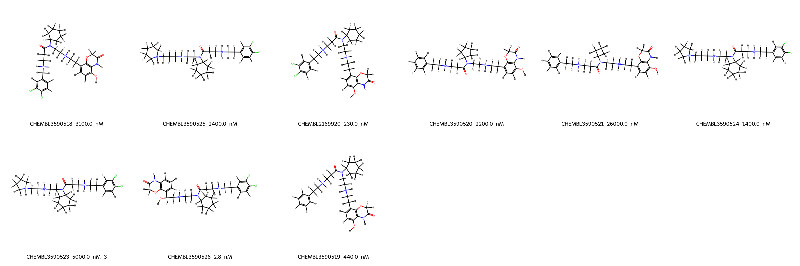
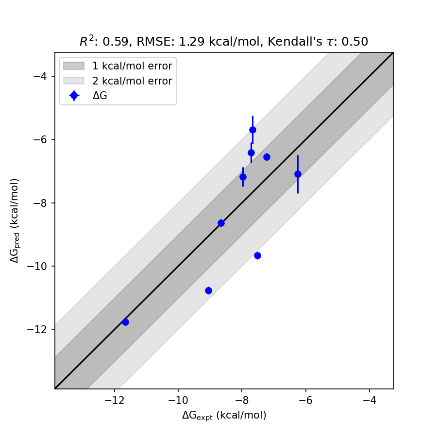

# SMYD2 System FEP Calculation Results Analysis

> This README is generated by AI model using verified experimental data and Uni-FEP calculation results. Content may contain inaccuracies and is provided for reference only. No liability is assumed for outcomes related to its use.

## Introduction

SMYD2 (SET and MYND domain-containing protein 2) is a lysine methyltransferase enzyme that plays a crucial role in epigenetic regulation by selectively methylating histone and non-histone proteins. SMYD2 is known to methylate H3K36 and H4K20 histone residues, as well as certain lysine residues on transcription factor p53 and other proteins, influencing chromatin structure and transcription. It has been implicated in the progression of various cancers, including hepatocellular carcinoma and esophageal cancer, owing to its roles in cell cycle control and tumorigenesis. SMYD2 has emerged as a promising therapeutic target for cancer treatment, with efforts directed towards developing selective inhibitors to modulate its activity for therapeutic benefit.

## Molecules

The SMYD2 dataset analyzed here consists of 10 compounds with diverse chemical structures and functional groups that interact with the active site of SMYD2. The experimentally determined binding affinities of these molecules range from 2.8 nM to 26000 nM, translating to free energies (ΔG) from -11.66 kcal/mol to -6.25 kcal/mol. These compounds exhibit structural variation that includes substitutions including halogens and groups with differing steric and electronic properties. 

## Conclusions

The FEP calculation results for the SMYD2 system showed moderate correlation with experimental data, with an R² of 0.59 and an RMSE of 1.29 kcal/mol. Among the compounds analyzed, CHEMBL3590526 emerged as a standout example, with experimental and predicted binding free energy values closely aligned (-11.66 kcal/mol experimental, -11.76 kcal/mol predicted, with a very low standard deviation of 0.09 kcal/mol). The predicted binding free energies across the dataset largely captured the relative binding trends of the compounds, with values ranging from -6.54 kcal/mol to -11.76 kcal/mol. These results support the potential of computational models to provide insights into binding affinities and trends.

## References

For more information about the SMYD2 target and associated bioactivity data, please visit:
[https://www.ebi.ac.uk/chembl/explore/assay/CHEMBL3592282](https://www.ebi.ac.uk/chembl/explore/assay/CHEMBL3592282) 