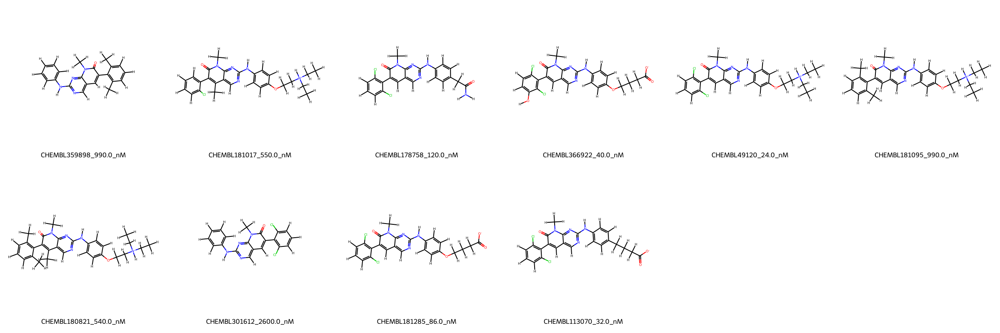
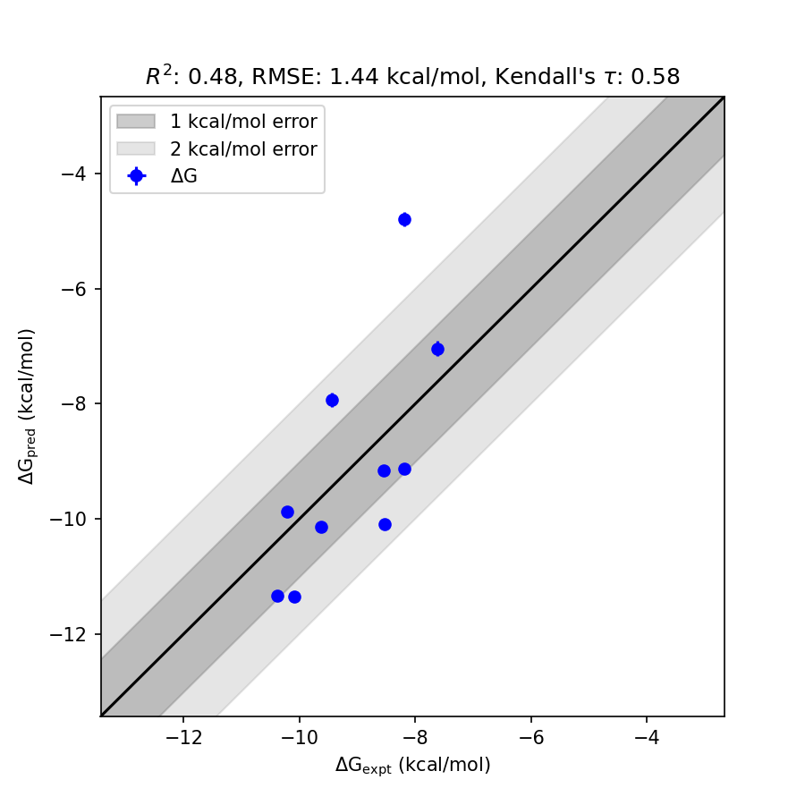

# WEE1 System FEP Calculation Results Analysis

> This README is generated by an AI model using verified experimental data and Uni-FEP calculation results. Content may contain inaccuracies and is provided for reference only. No liability is assumed for outcomes related to its use.

## Introduction

WEE1 is a nuclear protein tyrosine kinase involved in the regulation of cell cycle progression, particularly at the G2/M checkpoint. This kinase inhibits cyclin-dependent kinases (CDKs) by phosphorylating them at inhibitory tyrosine residues, thereby preventing premature mitotic entry. Pharmacological inhibition of WEE1 disrupts the DNA damage repair process and forces cancer cells into mitotic catastrophe, making it an attractive therapeutic target, particularly for cancers with impaired p53 function, such as ovarian and breast cancers.

## Molecules

The WEE1 system dataset in this study consists of 11 compounds, showing a diverse range of chemical structures. These molecules have varying substituents, providing structural diversity to the dataset. 

The experimentally determined binding affinities for WEE1 inhibitors span a wide range, from 24 nM to 2600 nM, corresponding to binding free energies between -10.39 and -7.61 kcal/mol. These compounds exhibit a range of substitution patterns that contribute to their binding affinities and target interaction profiles.

## Conclusions

The FEP calculation results for the WEE1 system demonstrate moderate correlation with experimental data, achieving an RMSE of 1.44 kcal/mol and an R² value of 0.48. Among the evaluated inhibitors, CHEMBL366922 showcased excellent prediction accuracy, with an experimental binding free energy of -10.09 kcal/mol and a predicted value of -11.34 kcal/mol. Similarly, CHEMBL113070 displayed very consistent results, with an experimental binding free energy of -10.22 kcal/mol and a predicted value of -9.88 kcal/mol. These results reflect the ability of the computational model to reproduce relative binding trends.

## References

For more information about the WEE1 target and associated bioactivity data, please visit:  
https://www.ebi.ac.uk/chembl/explore/target/CHEMBL5230681  