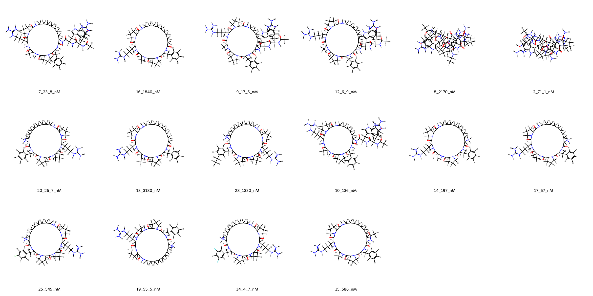
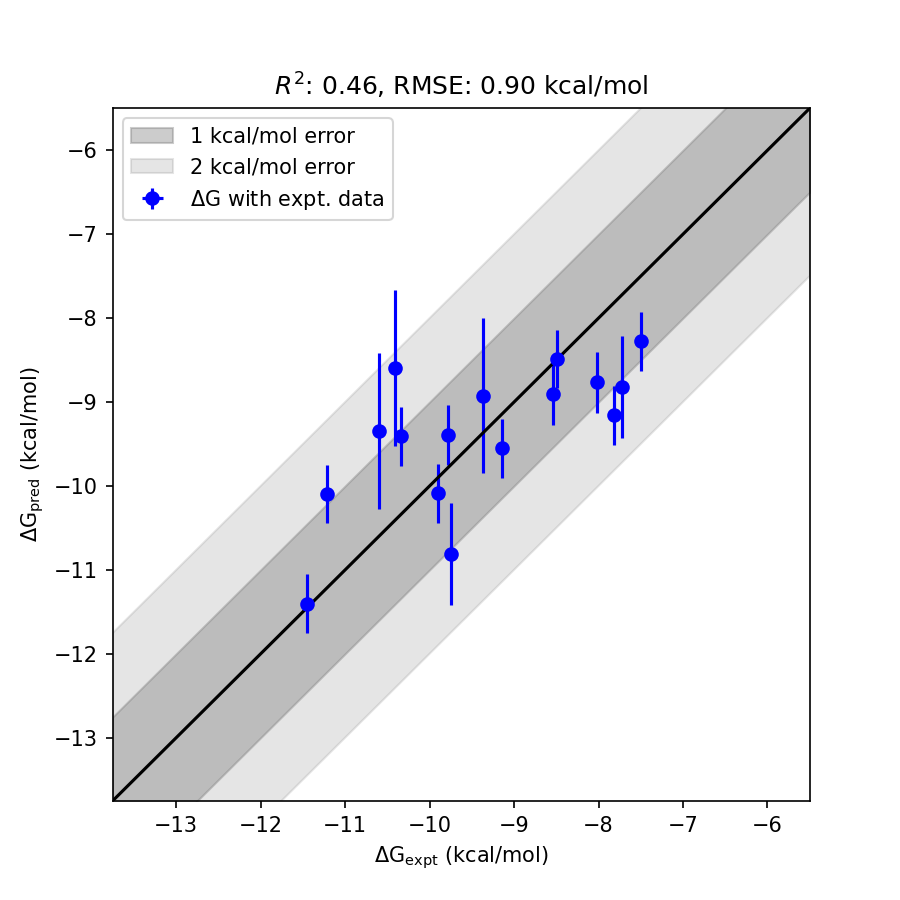

# Menin System FEP Calculation Results Analysis  

> This README is generated by AI model using verified experimental data and Uni-FEP calculation results. Content may contain inaccuracies and is provided for reference only. No liability is assumed for outcomes related to its use.  

## Introduction  

Menin, encoded by the **MEN1** gene, is a nuclear protein that plays a critical role in regulating transcription, chromatin structure, and cell signaling. It is widely known for its function as a tumor suppressor and its vital interactions with epigenetic modifiers like the Mixed Lineage Leukemia 1 (MLL1) protein. The protein-protein interaction (PPI) between Menin and MLL1 is implicated in certain cancers, most notably MLL-rearranged leukemia, making it an important therapeutic target. Consequently, inhibitors targeting the Menin-MLL1 PPI have gained significant attention in drug discovery to combat aggressive leukemias and other Menin-mediated malignancies.  

## Molecules  

  

The dataset for Menin analyzed in this study contains 15 compounds, spanning diverse chemical scaffolds. These molecules include macrocyclic peptidomimetics and linear small molecules designed to inhibit the Menin-MLL1 interaction. They display considerable structural variety, including guanidines, amides, and fluorinated aromatic groups, optimizing their interaction within the deep binding pocket of Menin.  

The experimental binding affinities range from **4.7 nM** to **3,180 nM**, corresponding to binding free energies between **-11.45 kcal/mol** and **-7.50 kcal/mol**.  

## Conclusions  

  

The Free Energy Perturbation (FEP) calculations for the Menin system demonstrated accurate predictions of experimental binding free energies, achieving an **RMSE** of **0.90 kcal/mol** and an **R²** of **0.46**. These results highlight the predictive reliability of the model for this target.  

Notable compounds with excellent prediction performance include **34_4_7_nM**, which has an experimental ΔG of **-11.45 kcal/mol**, closely matching its predicted ΔG of **-11.40 kcal/mol**, showcasing the accuracy of the calculations. Similarly, **12_6_9_nM** displayed strong agreement, with an experimental ΔG of **-11.21 kcal/mol** and a predicted ΔG of **-10.10 kcal/mol**.  

These findings underscore the value of FEP methodologies in capturing the binding free energy trends of chemically diverse Menin inhibitors, supporting their utility in drug discovery efforts targeting this critical protein.  

## References  

1. Zhou, H.; Liu, L.; Huang, J.; Bernard, D.; Karatas, H.; Navarro, A.; Lei, M.; Wang, S. Structure-Based Design of High-Affinity Macrocyclic Peptidomimetics to Block the Menin-Mixed Lineage Leukemia 1 (MLL1) Protein–Protein Interaction. *J. Med. Chem.* 2013, *56* (3), 1113–1123. https://doi.org/10.1021/jm3015298.  