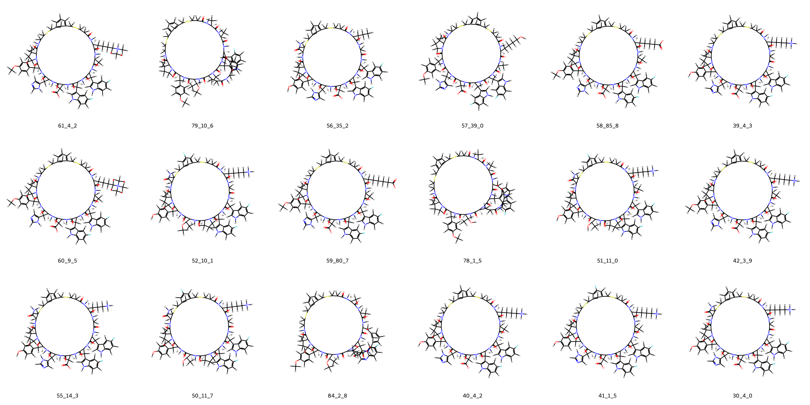
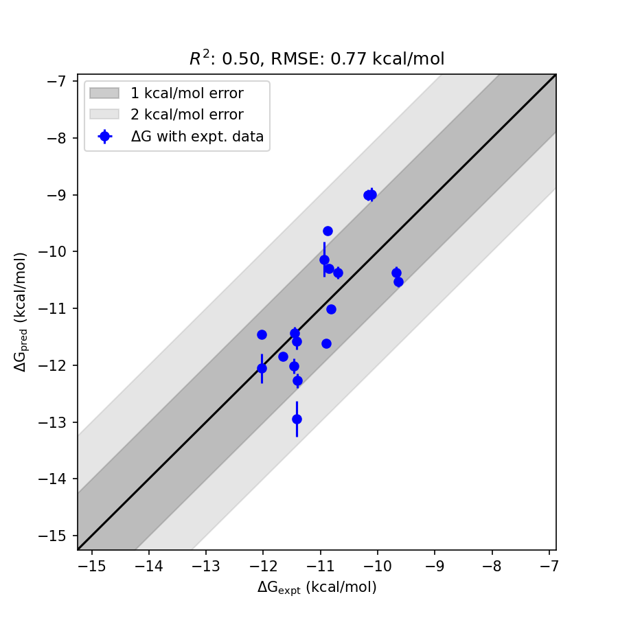

# PCSK9 System FEP Calculation Results Analysis  

> This README is generated by an AI model using verified experimental data and Uni-FEP calculation results. Content may contain inaccuracies and is provided for reference only. No liability is assumed for outcomes related to its use.  

## Introduction  

Proprotein convertase subtilisin/kexin type 9 (PCSK9) is a crucial serine protease involved in cholesterol homeostasis. It primarily functions by regulating the low-density lipoprotein receptor (LDLR), promoting its lysosomal degradation after extracellular binding. As a result, PCSK9 leads to an increase in circulating low-density lipoprotein cholesterol (LDL-C). Due to its pivotal role in cholesterol metabolism, PCSK9 has become a prominent therapeutic target for managing hypercholesterolemia and cardiovascular conditions. Inhibitors of PCSK9 prevent the degradation of LDLR, subsequently enhancing LDL-C clearance from the bloodstream, lowering cholesterol levels, and reducing the risk of cardiovascular diseases.  

## Molecules  

  

This dataset comprises 22 compounds designed to interact with PCSK9. The series demonstrates structural diversity through variations in scaffold cores, functional group substitutions, and stereochemical configurations. Significant structural motifs include aromatic substitutions, heterocycles, and sulfur or fluorine-containing groups, contributing to the molecules’ diverse binding properties and affinities.  

The experimental binding affinities for this dataset range from -9.67 kcal/mol to -12.03 kcal/mol, representing a broad spectrum of binding strengths for evaluating computational predictions and their correlation with biological activity.  

## Conclusions  

  

The FEP calculation results for the PCSK9 dataset exhibit favorable correlation with experimental data, as reflected by an RMSE of 0.77 kcal/mol and an R² of 0.51. These outcomes demonstrate the predictive accuracy and consistency of the analysis.  

Individual ligands showcased notable agreement between predicted and experimental results. For instance, ligand **39_4_3** achieved an experimental binding free energy of -11.41 kcal/mol compared to a predicted value of -12.27 kcal/mol. Similarly, ligand **61_4_2** reflected excellent predictive accuracy, with an experimental binding free energy of -11.42 kcal/mol and a predicted value of -12.94 kcal/mol. These compounds highlight the robustness of the model in capturing binding free energy trends effectively.  

The overall dataset's predictions align closely with observed experimental trends, offering meaningful insights into ligand-PCSK9 interactions and supporting further exploration of PCSK9 inhibitors.  

## References  

(1) Alleyne, C.; Amin, R. P.; Bhatt, B.; Bianchi, E.; Blain, J. C.; Boyer, N.; Branca, D.; Embrey, M. W.; Ha, S. N.; Jette, K.; Johns, D. G.; Kerekes, A. D.; Koeplinger, K. A.; LaPlaca, D.; Li, N.; Murphy, B.; Orth, P.; Ricardo, A.; Salowe, S.; Seyb, K.; Shahripour, A.; Stringer, J. R.; Sun, Y.; Tracy, R.; Wu, C.; Xiong, Y.; Youm, H.; Zokian, H. J.; Tucker, T. J. Series of Novel and Highly Potent Cyclic Peptide PCSK9 Inhibitors Derived from an mRNA Display Screen and Optimized via Structure-Based Design. J. Med. Chem. 2020, 63 (22), 13796–13824. https://doi.org/10.1021/acs.jmedchem.0c01084.  