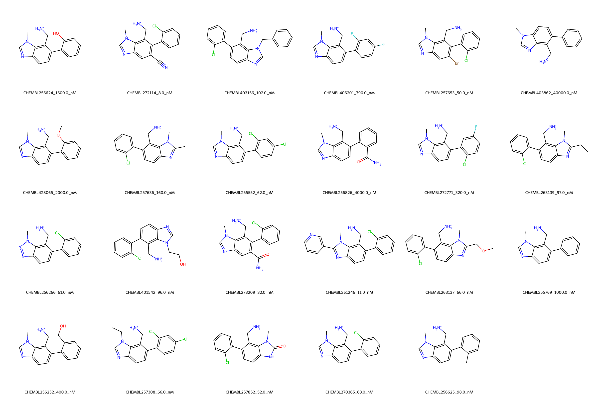

# DPP4 System FEP Calculation Results Analysis

## Target Introduction

DPP4 (Dipeptidyl Peptidase-4), also known as CD26, is a serine protease that plays a crucial role in glucose metabolism by degrading incretin hormones. It is a validated therapeutic target for type 2 diabetes treatment, with several approved inhibitors on the market. DPP4 inhibitors help maintain glucose homeostasis by prolonging the action of incretin hormones, which stimulate insulin secretion and suppress glucagon release.

## Dataset Analysis

The DPP4 system dataset in this study comprises 24 compounds, featuring a core structure with an imidazopyridine scaffold. The compounds exhibit diverse substitution patterns, particularly with various halogen substituents (chloro, fluoro, bromo) and other functional groups such as cyano, methoxy, and amino groups. These molecules share a common aminomethyl substituent that is crucial for binding to the target.

The experimentally determined binding affinities range from 8 nM to 40 μM, spanning approximately three orders of magnitude, with binding free energies from -5.99 to -11.04 kcal/mol.

## Conclusions

The FEP calculation results for the DPP4 system show moderate correlation with experimental data, achieving an R² of 0.61 and an RMSE of 0.74 kcal/mol. Several compounds demonstrated good prediction accuracy, such as CHEMBL261246 (experimental: -10.85 kcal/mol, predicted: -11.06 kcal/mol) and CHEMBL256625 (experimental: -9.56 kcal/mol, predicted: -9.55 kcal/mol). The predicted binding free energies ranged from -6.82 to -11.06 kcal/mol, generally aligning with the experimental range.

## References

For more information about the DPP4 target and associated bioactivity data, please visit:
https://www.ebi.ac.uk/chembl/explore/assay/CHEMBL951312 