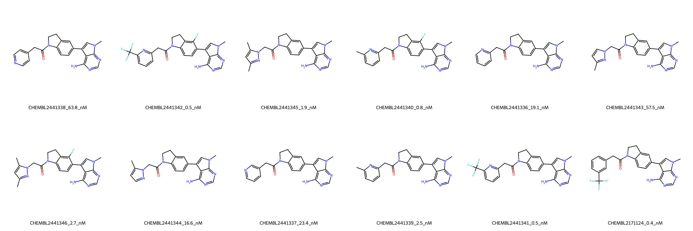

# EIF2AK3 System FEP Calculation Results Analysis

> This README is generated by AI model using verified experimental data and Uni-FEP calculation results. Content may contain inaccuracies and is provided for reference only. No liability is assumed for outcomes related to its use.

## Introduction

EIF2AK3 (Eukaryotic Translation Initiation Factor 2 Alpha Kinase 3), also known as PERK, is a key protein kinase involved in the unfolded protein response (UPR) pathway. It phosphorylates eIF2α in response to endoplasmic reticulum stress, leading to reduced protein synthesis and cell survival regulation. EIF2AK3 has emerged as an important therapeutic target for various diseases, including cancer and neurodegenerative disorders, due to its role in cellular stress response and protein homeostasis.

## Molecules

The EIF2AK3 system dataset in this study consists of 12 compounds, featuring a core structure with a pyrazolopyrimidine scaffold. The compounds share a common aminopyrimidine head group and exhibit diverse substitution patterns in their tail regions, including various substituents such as trifluoromethyl, methyl, and fluorine atoms. These molecules contain a characteristic indoline linker connected to different aromatic groups.

The experimentally determined binding affinities range from 0.4 nM to 63.8 nM, spanning approximately two orders of magnitude, with binding free energies from -9.81 to -12.81 kcal/mol.

## Conclusions

The FEP calculation results for the EIF2AK3 system show moderate correlation with experimental data, achieving an R² of 0.65 and an RMSE of 1.17 kcal/mol. Several compounds demonstrated excellent prediction accuracy, such as CHEMBL2171124 (experimental: -12.81 kcal/mol, predicted: -12.85 kcal/mol) and CHEMBL2441341 (experimental: -12.68 kcal/mol, predicted: -12.54 kcal/mol). The predicted binding free energies ranged from -7.82 to -14.43 kcal/mol, generally capturing the relative binding trends of the series.

## References

For more information about the EIF2AK3 target and associated bioactivity data, please visit:
https://www.ebi.ac.uk/chembl/explore/assay/CHEMBL2444392 