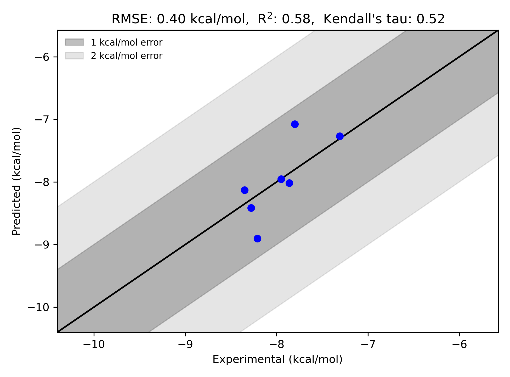

# Eg5 System FEP Calculation Results Analysis

> This README is generated by AI model using verified experimental data and Uni-FEP calculation results. Content may contain inaccuracies and is provided for reference only. No liability is assumed for outcomes related to its use.

## Introduction

Eg5 (also known as KIF11 or kinesin spindle protein) is a motor protein that plays a crucial role in mitotic spindle assembly and maintenance during cell division. It is responsible for the separation of duplicated centrosomes and the formation of bipolar spindles. Due to its essential role in cell division, Eg5 has emerged as an important therapeutic target in cancer treatment, particularly for tumors that show high rates of proliferation. Inhibition of Eg5 leads to mitotic arrest and subsequent cell death, making it an attractive target for anti-cancer drug development.

## Molecules

The Eg5 system dataset in this study consists of 7 compounds, featuring a thiadiazole core structure with various substituents. The compounds share a common N-acetylated thiadiazole scaffold and demonstrate structural diversity through different aromatic and heteroaromatic substituents, including phenyl, thiophene, and furan rings. Notable structural features include various halogen substitutions and modifications to the aromatic systems that influence binding affinity.

The experimentally determined binding free energies span a range from -7.31 to -8.35 kcal/mol, representing a moderate range of binding affinities that covers approximately 1 order of magnitude in terms of binding constants.

## Conclusions

The FEP calculation results for the Eg5 system show moderate correlation with experimental data, achieving an R² of 0.58 and an RMSE of 0.40 kcal/mol. Several compounds demonstrated good prediction accuracy, such as compound EG_Cpd2 (experimental: -7.95 kcal/mol, predicted: -7.95 kcal/mol) and compound EG_Cpd26 (experimental: -7.31 kcal/mol, predicted: -7.27 kcal/mol). The predicted binding free energies ranged from -7.07 to -8.90 kcal/mol, effectively capturing the relative binding trends of the series.

## References

> Talapatra SK, Tham CL, Guglielmi P, Cirilli R, Chandrasekaran B, Karpoormath R, Carradori S, Kozielski F. Crystal structure of the Eg5-K858 complex and implications for structure-based design of thiadiazole-containing inhibitors. European Journal of Medicinal Chemistry. 2018 Aug 5;156:641-51. 