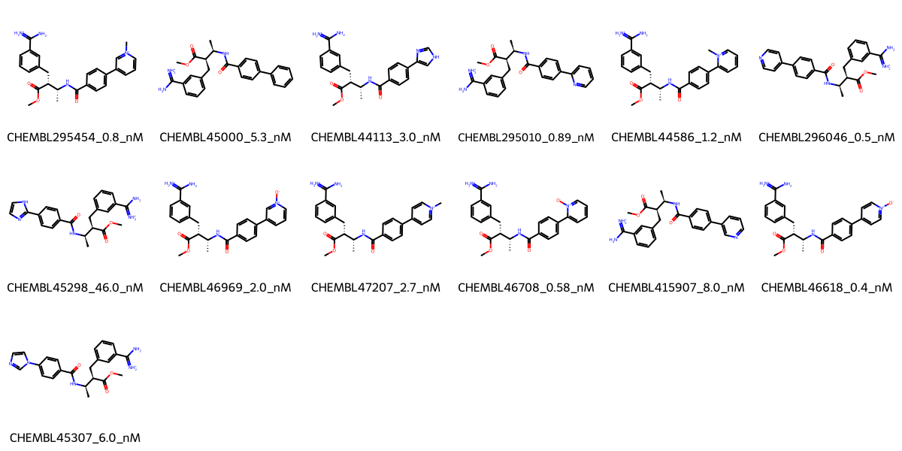

# F10 System FEP Calculation Results Analysis

## Target Introduction

F10 (Coagulation Factor X) is a vitamin K-dependent serine protease that plays a central role in the blood coagulation cascade. It is activated to form factor Xa, which converts prothrombin to thrombin, leading to blood clot formation. F10 is a well-established therapeutic target for anticoagulation therapy, with several approved drugs targeting this enzyme for the prevention and treatment of thrombotic disorders.

## Dataset Analysis

The F10 system dataset in this study consists of 13 compounds, featuring a complex scaffold with multiple chiral centers. The compounds share a common amidine-substituted phenyl ring and a methyl ester group. These molecules demonstrate structural diversity through various heterocyclic substituents, including pyridinium, pyridine N-oxide, and pyrazole rings, connected through a benzamide linker.

The experimentally determined binding affinities range from 0.4 nM to 46 nM, spanning approximately two orders of magnitude, with binding free energies from -10.00 to -12.81 kcal/mol.

## Conclusions

The FEP calculation results for the F10 system show moderate correlation with experimental data, achieving an R² of 0.41 and an RMSE of 0.85 kcal/mol. Several compounds demonstrated good prediction accuracy, such as CHEMBL45307 (experimental: -11.21 kcal/mol, predicted: -11.16 kcal/mol) and CHEMBL46618 (experimental: -12.81 kcal/mol, predicted: -13.02 kcal/mol). The predicted binding free energies ranged from -10.07 to -14.00 kcal/mol, generally capturing the relative binding trends of the series.

## References

For more information about the F10 target and associated bioactivity data, please visit:
https://www.ebi.ac.uk/chembl/explore/assay/CHEMBL661586 