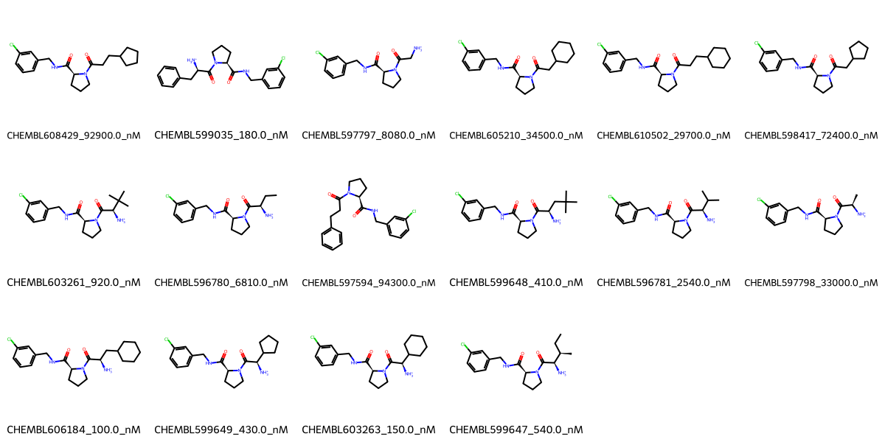

# F2 System FEP Calculation Results Analysis

> This README is generated by AI model using verified experimental data and Uni-FEP calculation results. Content may contain inaccuracies and is provided for reference only. No liability is assumed for outcomes related to its use.

## Introduction

F2 (Coagulation Factor II or Prothrombin) is a key serine protease in the blood coagulation cascade that, when activated to thrombin, converts fibrinogen to fibrin and promotes platelet aggregation. It is a crucial target for anticoagulation therapy, with several direct thrombin inhibitors approved for clinical use in the prevention and treatment of thrombotic disorders.

## Molecules

The F2 system dataset in this study consists of 16 compounds, featuring a core structure with a chlorophenyl group connected to a pyrrolidine ring through an amide linker. The compounds demonstrate structural diversity through various substituents at the pyrrolidine nitrogen, including different cycloalkyl groups and amino-substituted alkyl chains. These molecules share a common chlorobenzyl amide motif while varying in their cyclic and acyclic substituents.

The experimentally determined binding affinities range from 100 nM to 94.3 μM, spanning approximately three orders of magnitude, with binding free energies from -5.49 to -9.54 kcal/mol.

## Conclusions

The FEP calculation results for the F2 system show good correlation with experimental data, achieving an R² of 0.65 and an RMSE of 0.84 kcal/mol. Several compounds demonstrated excellent prediction accuracy, such as CHEMBL606184 (experimental: -9.54 kcal/mol, predicted: -9.76 kcal/mol) and CHEMBL599647 (experimental: -8.55 kcal/mol, predicted: -8.49 kcal/mol). The predicted binding free energies ranged from -5.74 to -9.76 kcal/mol, generally capturing the relative binding trends of the series.

## References

For more information about the F2 target and associated bioactivity data, please visit:
https://www.ebi.ac.uk/chembl/explore/assay/CHEMBL1067528 