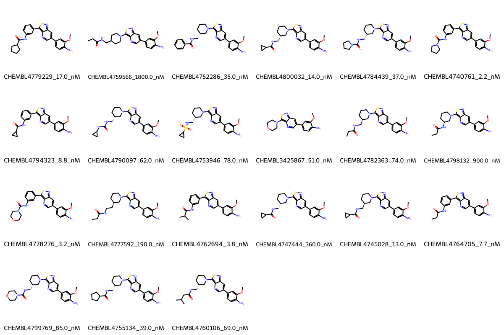

# GAK System FEP Calculation Results Analysis

## Target Introduction

GAK (Cyclin G Associated Kinase) is a serine/threonine kinase that plays important roles in cellular processes including clathrin-mediated membrane trafficking and cell cycle regulation. It is a member of the NAK (Numb-associated kinase) family and has been implicated in various diseases, including cancer and neurological disorders. GAK inhibition has emerged as a potential therapeutic strategy, particularly in the context of cancer treatment.

## Dataset Analysis

The GAK system dataset in this study comprises 21 compounds, featuring a core structure with a thiazolopyrimidine scaffold. The compounds share a common 4-methoxy-3-aminophenyl substituent and exhibit diverse modifications at the thiazolopyrimidine core, including various cyclic amines and amide-linked substituents. These molecules demonstrate structural diversity through different cycloalkyl, urea, and sulfonamide modifications.

The experimentally determined binding affinities range from 2.2 nM to 1800 nM, spanning approximately three orders of magnitude, with binding free energies from -7.83 to -11.81 kcal/mol.

## Conclusions

The FEP calculation results for the GAK system show moderate correlation with experimental data, achieving an R² of 0.63 and an RMSE of 1.11 kcal/mol. Several compounds demonstrated good prediction accuracy, such as CHEMBL4764705 (experimental: -11.06 kcal/mol, predicted: -11.21 kcal/mol) and CHEMBL4760106 (experimental: -9.76 kcal/mol, predicted: -9.77 kcal/mol). The predicted binding free energies ranged from -5.53 to -13.68 kcal/mol, generally capturing the relative binding trends of the series.

## References

For more information about the GAK target and associated bioactivity data, please visit:
https://www.ebi.ac.uk/chembl/explore/assay/CHEMBL4736826 