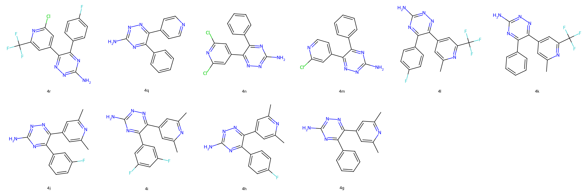
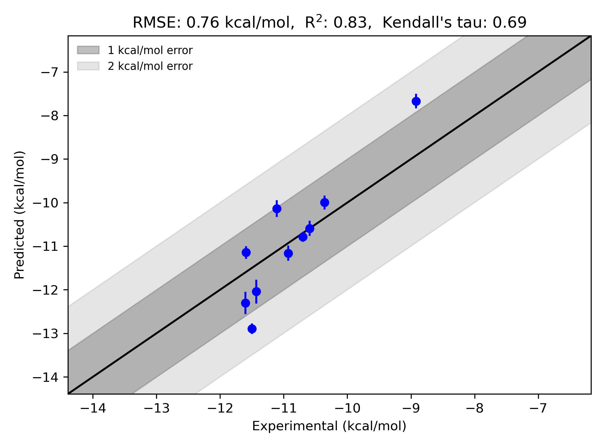

# GPCR|A2A System FEP Calculation Results Analysis

> This README is generated by an AI model using verified experimental data and Uni-FEP calculation results. Content may contain inaccuracies and is provided for reference only. No liability is assumed for outcomes related to its use.

## Introduction

The adenosine receptor A2A (A2AR) is a G protein-coupled receptor (GPCR) that plays a significant role in a variety of physiological processes, including neurotransmission, immune responses, and cardiovascular regulation. A2AR is activated by the endogenous ligand adenosine and is widely distributed in human tissues, with high expression in the central nervous system. The receptor is a key target for therapeutic intervention, particularly in diseases such as Parkinson’s disease, cancer, and inflammation. Due to its accessibility, well-known signaling pathways, and its implication in a variety of pathologies, A2AR has become a model system for GPCR drug discovery. This study leverages free energy perturbation (FEP) calculations to analyze molecular interactions with this therapeutically important target.

## Molecules

The A2AR system dataset in this study consists of 10 ligands, showcasing diverse chemical scaffolds and substituents. These molecules exhibit a range of interactions with the binding pocket, characterized by different functional groups contributing to hydrogen bonding, π-π stacking, and hydrophobic interactions. 

The experimental binding free energies (exp_dG) for the ligands span from -8.92 to -11.6 kcal/mol, and the corresponding predicted free energies (fep_dG) range from -7.669 to -12.893 kcal/mol. This dataset highlights compounds with varying affinities, providing an excellent test case for evaluating the accuracy of FEP-based predictions.

## Conclusions

The FEP calculation results for the A2AR system achieved a remarkable performance, with an R² of 0.83 and an RMSE of 0.76 kcal/mol, indicating strong agreement between predicted and experimental binding free energies. The high correlation reflects the robust predictive capacity of the FEP approach for GPCR targets.

Several compounds demonstrated excellent prediction accuracy. For instance, ligand "4r" was a standout case, with an experimental binding free energy of -11.5 kcal/mol and a predicted free energy of -12.893 kcal/mol. Similarly, ligand "4m" achieved near-perfect consistency, with exp_dG of -10.59 kcal/mol and fep_dG of -10.593 kcal/mol. These results highlight the capability of FEP to accurately capture the subtle energetic contributions to binding affinity in GPCR systems.

Overall, the results underscore the utility of FEP in advancing lead optimization and rational design efforts for GPCR drug discovery projects.

## References

Deflorian F, Perez-Benito L, Lenselink EB, Congreve M, van Vlijmen HW, Mason JS, Graaf CD, Tresadern G. Accurate prediction of GPCR ligand binding affinity with free energy perturbation. *Journal of Chemical Information and Modeling.* 2020 Jun 15;60(11):5563-79. [https://pubs.acs.org/doi/10.1021/acs.jcim.0c00449](https://pubs.acs.org/doi/10.1021/acs.jcim.0c00449)