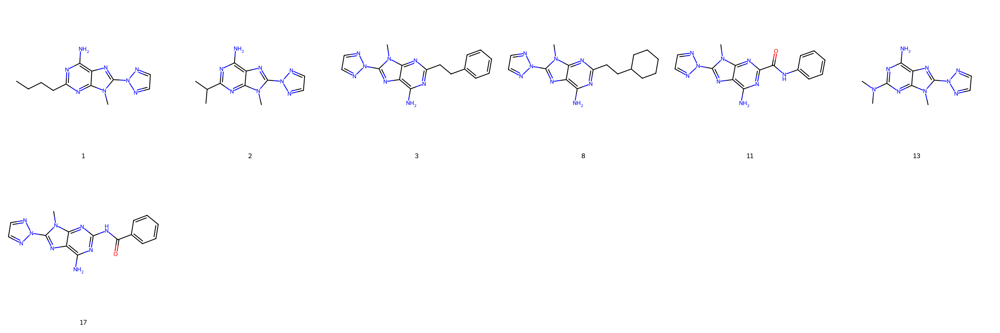
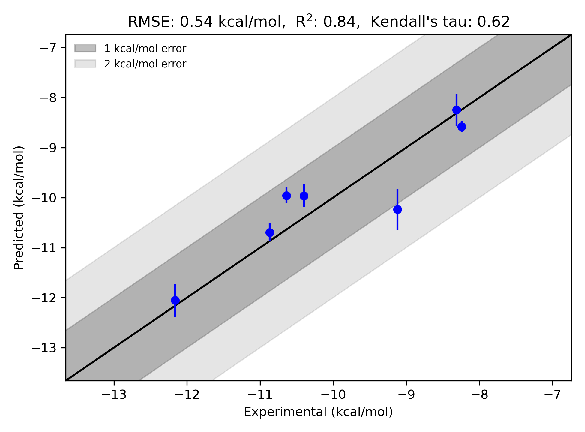

# GPCR A2A System FEP Calculation Results Analysis

> This README is generated by AI model using verified experimental data and Uni-FEP calculation results. Content may contain inaccuracies and is provided for reference only. No liability is assumed for outcomes related to its use.

## Introduction

The adenosine A2A receptor (A2AR) belongs to the G-protein-coupled receptor (GPCR) family and is a key player in adenosine signaling pathways. It is predominantly expressed in the central nervous system, particularly in the basal ganglia, and also found in other tissues such as the heart and immune cells. A2AR modulates various physiological processes, including neurotransmission, inflammation, and vascular functions. It is implicated in neurological disorders like Parkinson's disease and Huntington's disease, as well as in immune response modulation, making it an attractive therapeutic target for drug discovery. A2AR antagonists have been explored for their potential in treating neurodegenerative diseases and cancer immunotherapy.

## Molecules

The dataset for the A2AR target consists of 7 ligands with diverse chemical scaffolds and substituents. These compounds exhibit variation in their binding affinities and structural features, contributing to the richness and complexity of the dataset. For instance, ligands in this series include heterocyclic substitutions, linear and branched alkyl chains, and functional groups such as amines and carbonyls that interact with the receptor binding pocket in unique ways.

Across the series, the experimentally determined binding free energies (ΔG) range from approximately -8.24 kcal/mol to -12.16 kcal/mol, illustrating a large dynamic range in binding affinities. These differences capture the chemical diversity and receptor interaction profiles of these ligands.

## Conclusions

The statistical analysis for the A2AR system FEP results is promising, showcasing strong predictive capabilities. The calculated RMSE of 0.54 kcal/mol and R² of 0.84 indicate a high level of agreement between predicted and experimental binding free energies.

Notably, several compounds demonstrate exceptional agreement between experimental and FEP-predicted ΔG values. For example, ligand 8 achieves remarkable predictive accuracy, with an experimental binding free energy of -12.16 kcal/mol and a corresponding predicted ΔG of -12.055 kcal/mol. Similarly, ligand 1 exhibits excellent correlation, with an experimental value of -10.87 kcal/mol and a calculated ΔG of -10.699 kcal/mol. These results illustrate the strength of the FEP methodology in capturing relative binding affinities within a chemical series and its effectiveness for computational modeling of GPCR targets.

## References

Deflorian F, Perez-Benito L, Lenselink EB, Congreve M, van Vlijmen HW, Mason JS, Graaf CD, Tresadern G. Accurate prediction of GPCR ligand binding affinity with free energy perturbation. *Journal of Chemical Information and Modeling*. 2020 Jun 15;60(11):5563-79. [https://pubs.acs.org/doi/10.1021/acs.jcim.0c00449](https://pubs.acs.org/doi/10.1021/acs.jcim.0c00449)