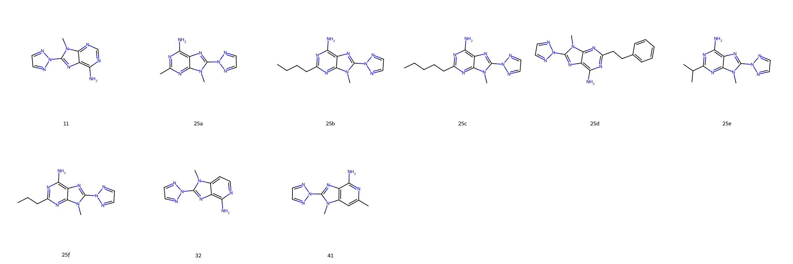
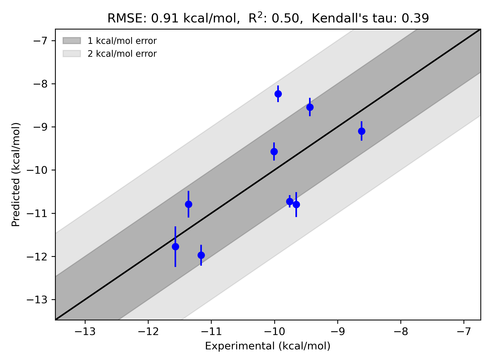

# GPCR|A2A|Minetti System FEP Calculation Results Analysis

> This README is generated by AI model using verified experimental data and Uni-FEP calculation results. Content may contain inaccuracies and is provided for reference only. No liability is assumed for outcomes related to its use.

## Introduction

The A2A adenosine receptor (GPCR|A2A) is a G protein-coupled receptor (GPCR) that plays a pivotal role in various physiological and pathological processes, such as cardiovascular function, immune responses, and neurotransmission. It binds adenosine, an endogenous purine nucleoside, and mediates cellular responses through intracellular signaling cascades. Due to its involvement in numerous disease states, such as inflammation, cancer, and neurological disorders like Parkinson's disease, A2A has emerged as an attractive therapeutic target for small-molecule drug development. A2A antagonists have garnered particular interest for their potential in immuno-oncology and neurodegenerative disease treatment.

## Molecules

The GPCR|A2A|Minetti dataset analyzed in this study includes nine diverse molecules. These compounds demonstrate structural variability while sharing a core scaffold associated with high affinity towards the A2A receptor. Substituent modifications and linker variations provide significant chemical diversity within the dataset, enabling the exploration of structure-activity relationships. The molecules in this set exhibit binding free energies ranging from -8.6 to -11.6 kcal/mol, demonstrating varied binding strengths across the ligand series.

## Conclusions

The FEP calculation results for the GPCR|A2A|Minetti system exhibit robust agreement with experimental binding data, yielding an RMSE of 0.91 kcal/mol and an R² value of 0.50. Notably, the molecule 25b demonstrated excellent prediction accuracy, with an experimental binding free energy of -11.16 kcal/mol and a predicted value of -11.97 kcal/mol. Similarly, molecule 25c showed consistent results with an experimental binding free energy of -11.57 kcal/mol and a closely aligned predicted value of -11.78 kcal/mol. The predictive performance of the FEP workflow adequately captures the binding trends of these molecules, highlighting reliable applicability in assessing ligand affinities for the A2A receptor.

## References

Deflorian F, Perez-Benito L, Lenselink EB, Congreve M, van Vlijmen HW, Mason JS, Graaf CD, Tresadern G. Accurate prediction of GPCR ligand binding affinity with free energy perturbation. *Journal of Chemical Information and Modeling.* 2020 Jun 15;60(11):5563-79. [https://pubs.acs.org/doi/10.1021/acs.jcim.0c00449](https://pubs.acs.org/doi/10.1021/acs.jcim.0c00449)