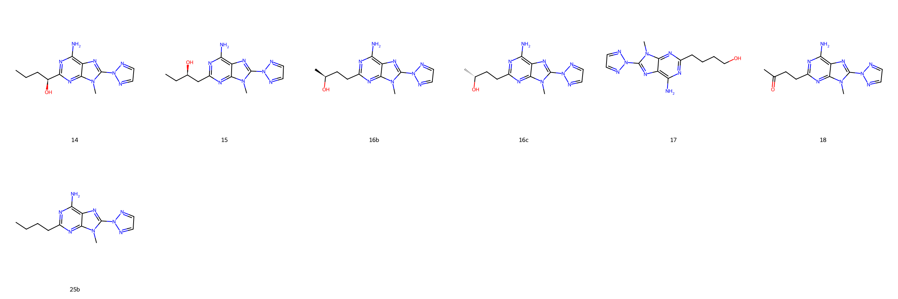
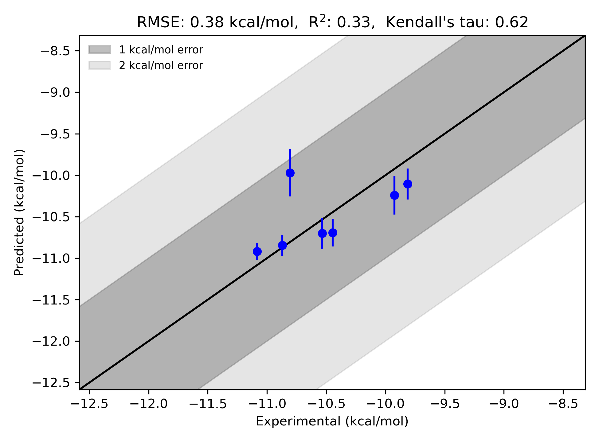

# GPCR A2A Piersanti System FEP Calculation Results Analysis

> This README is generated by AI model using verified experimental data and Uni-FEP calculation results. Content may contain inaccuracies and is provided for reference only. No liability is assumed for outcomes related to its use.

## Introduction

The adenosine A2A receptor (A2A) is a member of the G protein-coupled receptor (GPCR) family. As an essential receptor subtype within the adenosine receptor family, it plays a critical role in a wide range of physiological and pathological processes, including cardiovascular regulation, immune response modulation, and central nervous system activities. Specifically, the A2A receptor is a key therapeutic target in neurodegenerative disorders such as Parkinson's disease and has also shown potential in immuno-oncology for its role in suppressing immune responses in the tumor microenvironment. The highly conserved structure and well-defined binding pocket of the A2A receptor make it a popular system for structure-based drug design and computational studies.

## Molecules

The GPCR A2A Piersanti dataset in this study encompasses a variety of ligands showing structural diversity. These molecules demonstrate a wide experimental binding free energy range, from -9.81 kcal/mol to -11.08 kcal/mol, highlighting their different affinities to the A2A receptor. The dataset includes stereochemical variations as well as subtle differences in substituents, including alcohol and carboxyl functionalities at diverse positions. These variations provide an excellent test set for evaluating the predictive power of computational free energy perturbation (FEP) methods.

## Conclusions

The FEP calculation results for the GPCR A2A Piersanti system demonstrate good accuracy and consistency with experimental binding free energies. The statistical evaluation of predictions achieved an RMSE of 0.38 kcal/mol and an R² of 0.33, which reflects the ability of the method to capture binding energy trends for this challenging biological system. 

Among the tested compounds, Ligand 16c exhibited exceptional agreement between experimental and predicted values, with a measured binding free energy of -11.084 kcal/mol and a predicted value of -10.918 kcal/mol. Additionally, Ligand 14 was well-predicted, with an experimental binding free energy of -10.446 kcal/mol and a predicted value of -10.693 kcal/mol. Such cases highlight the stability and robustness of the FEP methodology for capturing key ligand-receptor interactions in the A2A receptor system.

## References

Deflorian F, Perez-Benito L, Lenselink EB, Congreve M, van Vlijmen HW, Mason JS, Graaf CD, Tresadern G. Accurate prediction of GPCR ligand binding affinity with free energy perturbation. *Journal of Chemical Information and Modeling.* 2020 Jun 15;60(11):5563–79. https://pubs.acs.org/doi/10.1021/acs.jcim.0c00449