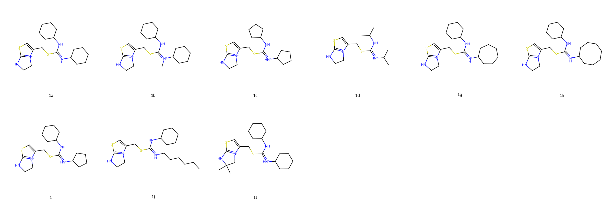
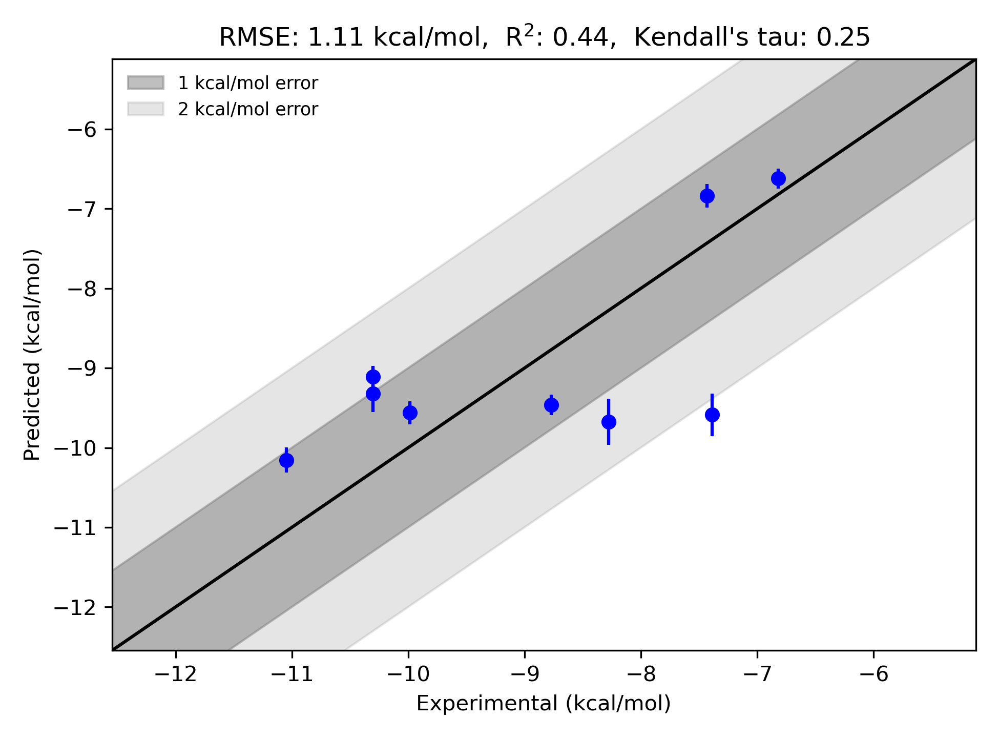

# GPCR | CXCR4 System FEP Calculation Results Analysis  

> This README is generated by AI model using verified experimental data and Uni-FEP calculation results. Content may contain inaccuracies and is provided for reference only. No liability is assumed for outcomes related to its use.  

## Introduction  

CXCR4 (C-X-C chemokine receptor type 4) is a G-protein-coupled receptor (GPCR) that is involved in multiple physiological and pathological processes. CXCR4 plays a crucial role in immune system function by mediating the homing and migration of immune cells, including hematopoietic stem cells, via interactions with its natural ligand, CXCL12 (stromal cell-derived factor-1). Additionally, CXCR4 has been shown to be involved in cancer metastasis, HIV infection, and inflammation, making it an important therapeutic target. In oncology, CXCR4 antagonists are being investigated for their ability to disrupt tumor growth and prevent metastasis by blocking the tumor-stroma communication.  

## Molecules  

  

The CXCR4 dataset includes 10 ligand molecules, which exhibit structural diversity and modifications to optimize binding affinity to CXCR4. These ligands feature various functional groups known to interact favorably with the receptor binding pocket, contributing to their inhibitory potency.  

The experimentally measured binding free energies of the ligands range from -6.821 kcal/mol to -11.046 kcal/mol. Representative molecules include ligand `1a` with an experimental binding free energy of -9.984 kcal/mol and ligand `1t` with -11.046 kcal/mol. These ligands highlight the wide span of binding affinities targeting CXCR4 and demonstrate potent interactions with the receptor.  

## Conclusions  

  

The FEP calculation results for the CXCR4 system demonstrate consistency with experimental binding free energies, showing an RMSE of 1.11 kcal/mol and R² of 0.44. This reflects a moderate correlation between predicted and experimental data.  

Noteworthy cases include ligand `1a`, which showed predicted binding free energy (-9.561 kcal/mol) close to its experimental value (-9.984 kcal/mol). Similarly, ligand `1t` displayed strong concordance between predicted (-10.155 kcal/mol) and experimental (-11.046 kcal/mol) binding free energies, reflecting the predictive accuracy of the FEP approach for certain potent ligands.  

## References  

Deflorian F, Perez-Benito L, Lenselink EB, Congreve M, van Vlijmen HW, Mason JS, Graaf CD, Tresadern G. Accurate prediction of GPCR ligand binding affinity with free energy perturbation. *Journal of Chemical Information and Modeling*. 2020 Jun 15;60(11):5563-79. [https://pubs.acs.org/doi/10.1021/acs.jcim.0c00449](https://pubs.acs.org/doi/10.1021/acs.jcim.0c00449)  