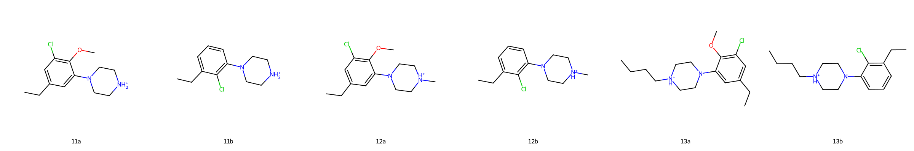
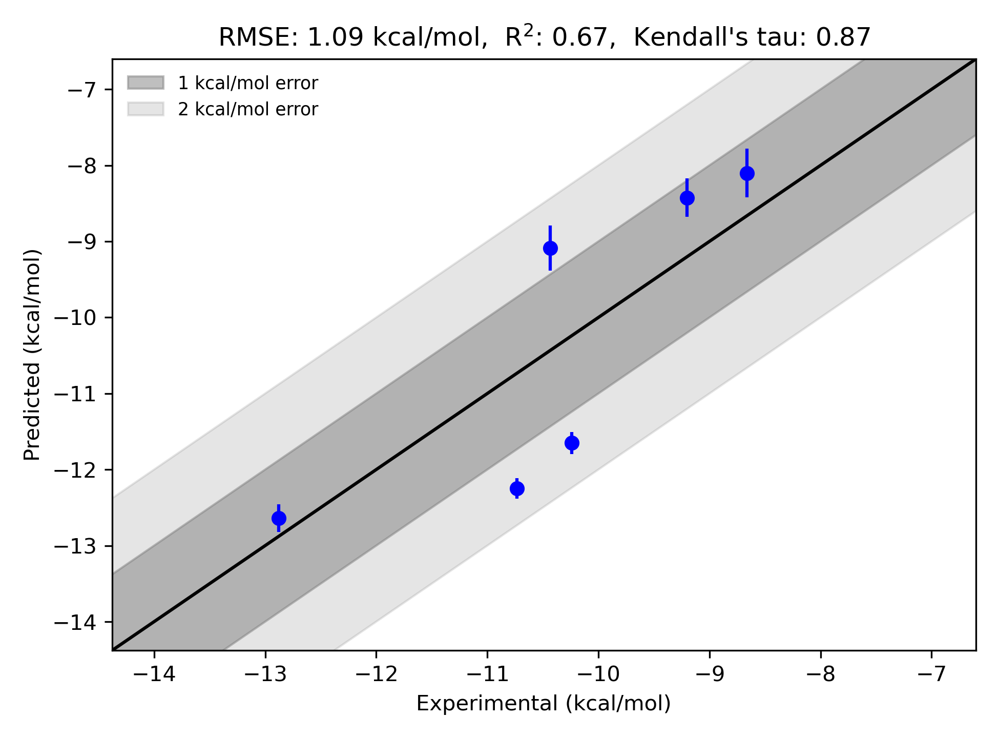

# GPCR|D3 System FEP Calculation Results Analysis

## Introduction

Dopamine receptor D3 (GPCR|D3) is a subtype of the D2-like dopamine receptors, which belong to the G protein-coupled receptor (GPCR) family. The D3 receptor has gained significant attention due to its role in modulating neurotransmission and its therapeutic potential for treating neurological and psychiatric disorders, including schizophrenia, Parkinson’s disease, and addiction. It is primarily expressed in limbic regions of the brain, such as the olfactory tubercle, islands of Calleja, and nucleus accumbens, which are associated with emotion and cognition. Selective D3 receptor modulators are of high interest for developing effective drugs with improved selectivity and minimized side effects.

## Molecules

The GPCR|D3 system dataset includes a diverse set of ligand molecules. The experimental binding free energies (ΔG) range from -8.66 kcal/mol to -12.88 kcal/mol. The molecular series in this study feature core scaffolds, including aromatic rings substituted with halogens, amine groups, as well as ether and alkyl linkages, demonstrating structural variations that can affect binding affinity and selectivity towards the D3 receptor. These functional groups contribute to both steric and electronic properties when interacting with the receptor binding site.

## Conclusions

The FEP calculation results for GPCR|D3 demonstrate good alignment with experimental data, achieving an RMSE of 1.09 kcal/mol and an R² of 0.67, indicating that the computational predictions effectively capture the relative binding trends across the series. Certain compounds exhibit particularly accurate predicted binding free energy values, such as 11b (experimental: -10.241 kcal/mol, predicted: -11.651 kcal/mol) and 13b (experimental: -12.878 kcal/mol, predicted: -12.639 kcal/mol), signaling robust calculation results for these cases.

## References

Deflorian F, Perez-Benito L, Lenselink EB, Congreve M, van Vlijmen HW, Mason JS, Graaf CD, Tresadern G. Accurate prediction of GPCR ligand binding affinity with free energy perturbation. *Journal of Chemical Information and Modeling*. 2020 Jun 15;60(11):5563-79. [https://pubs.acs.org/doi/10.1021/acs.jcim.0c00449](https://pubs.acs.org/doi/10.1021/acs.jcim.0c00449)