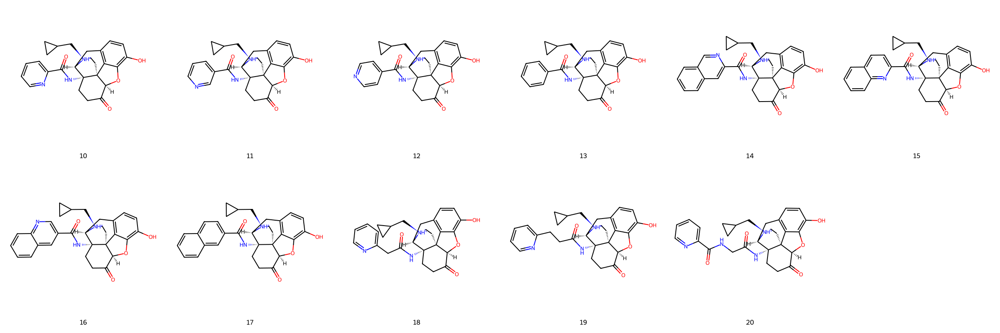
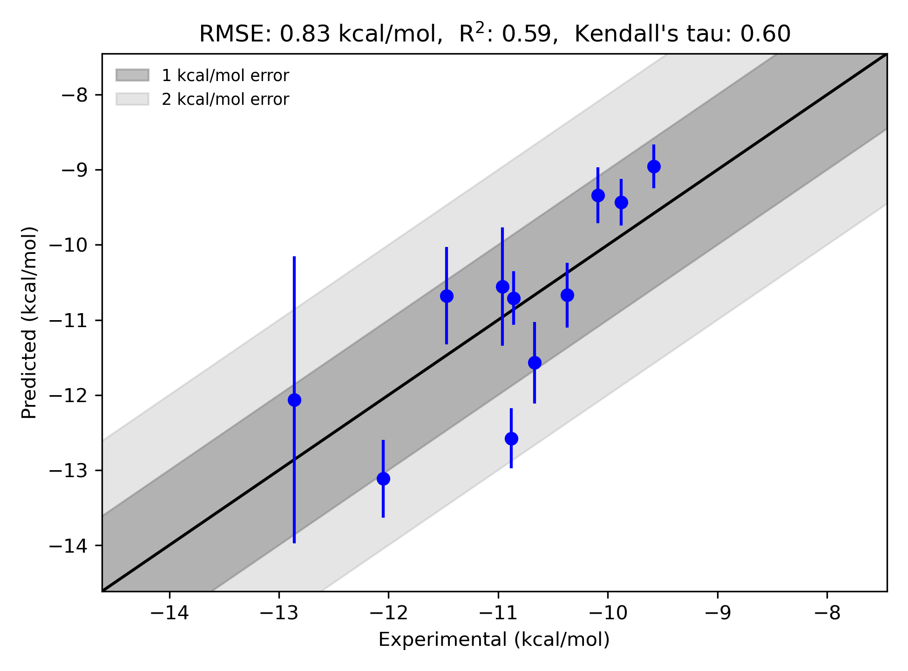

# GPCR|DOR System FEP Calculation Results Analysis  

> This README is generated by an AI model using verified experimental data and Uni-FEP calculation results. Content may contain inaccuracies and is provided for reference only. No liability is assumed for outcomes related to its use.  

## Introduction  

The delta-opioid receptor (DOR) belongs to the G protein-coupled receptor (GPCR) superfamily and is implicated in various physiological processes. DOR primarily binds endogenous opioid peptides and plays a critical role in modulating pain, mood, and immune responses. Pharmacological modulation of DOR has therapeutic potential for conditions such as chronic pain, anxiety, and neurodegenerative diseases. Unlike its closely related opioid receptor subtypes (mu-opioid and kappa-opioid receptors), DOR has shown promise in providing analgesic effects with minimal risk of tolerance and addiction, making it an attractive target for drug discovery efforts.  

## Molecules  

  

The dataset for the GPCR|DOR system includes 11 ligands exhibiting a common core structure enriched with polar functional groups, including hydroxyl and carbonyl moieties, and aromatic scaffolds capable of engaging in π–π interactions with the receptor binding site. Structural diversity across this ligand set arises from varying substitutions on aromatic groups, linker modifications, and the inclusion of stereochemical variants in certain molecules.  

Experimentally determined binding free energies for the ligands range from -9.58 to -12.86 kcal/mol. These data reflect the suitability of the series for computational binding free energy predictions using molecular simulation methods.  

## Conclusions  

  

The FEP calculation results for GPCR|DOR display meaningful agreement with experimental binding free energy measurements. The calculated R² value of 0.59 and RMSE of 0.83 kcal/mol indicate the model's moderate predictive accuracy. Noteworthy examples of successful predictions include ligand 15 (experimental ΔG: -10.67 kcal/mol, predicted ΔG: -11.57 kcal/mol) and ligand 16 (experimental ΔG: -12.05 kcal/mol, predicted ΔG: -13.12 kcal/mol). These results highlight the ability of the method to capture relative trends in ligand binding affinities across the dataset.  

The study demonstrates the feasibility of employing FEP for modeling accurate ΔG values in GPCR systems, reinforcing its utility in structure-based drug design workflows targeting DOR and other GPCRs.  

## References  

Deflorian F, Perez-Benito L, Lenselink EB, Congreve M, van Vlijmen HW, Mason JS, Graaf CD, Tresadern G. Accurate prediction of GPCR ligand binding affinity with free energy perturbation. *Journal of Chemical Information and Modeling*. 2020 Jun 15;60(11):5563-79. [https://pubs.acs.org/doi/10.1021/acs.jcim.0c00449](https://pubs.acs.org/doi/10.1021/acs.jcim.0c00449)