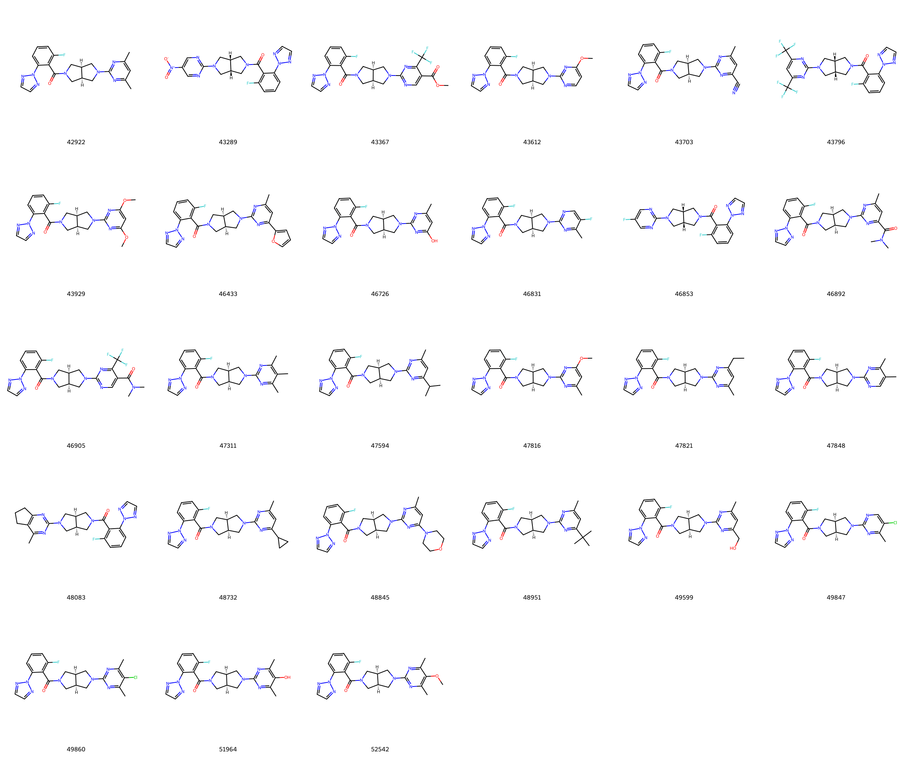
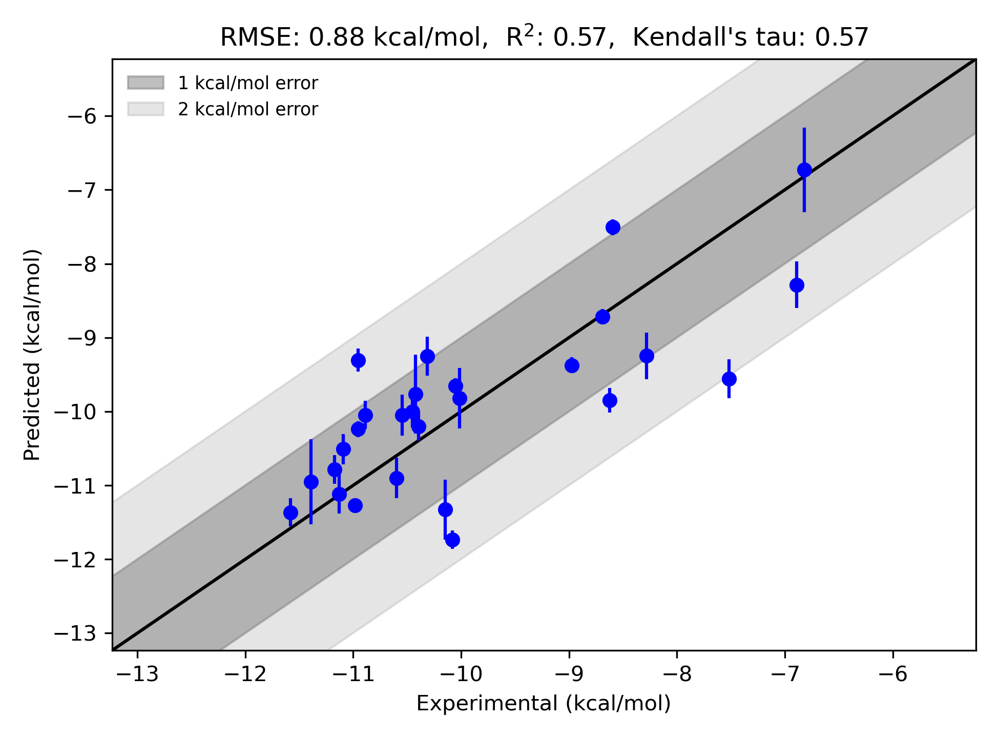

# GPCR|OX2-set1 System FEP Calculation Results Analysis

> This README is generated by AI model using verified experimental data and Uni-FEP calculation results. Content may contain inaccuracies and is provided for reference only. No liability is assumed for outcomes related to its use.

## Introduction

GPCR OX2, also known as Orexin receptor 2, belongs to the Class A G protein-coupled receptor (GPCR) family and acts as a critical regulator of wakefulness and sleep. It binds to neuropeptides orexin-A and orexin-B, which are involved in the modulation of appetite, reward systems, stress responses, and arousal. OX2 has gained significance as a therapeutic target for treating sleep disorders like narcolepsy and insomnia. Selective ligands for OX2 are also being explored for their applications in appetite control and potential implications in psychiatric disorders.

## Molecules

The GPCR|OX2-set1 system dataset analyzed in this study consists of 27 compounds that feature structural diversity in their substitutions across diverse scaffolds interacting within the GPCR binding pocket. These molecules include representative ligands such as amides, nitriles, hydroxylated derivatives, halogenated aromatics, and heterocyclic cores.

Experimentally measured binding free energies span a wide range, with values from as low as -6.89 kcal/mol to as high as -11.58 kcal/mol, showcasing the diversity in ligand affinity.

## Conclusions

The FEP calculation results for the GPCR|OX2-set1 system achieved an RMSE of 0.88 kcal/mol and an R² of 0.57, indicating a moderate correlation between experimental and predicted data. Certain ligands displayed excellent accuracy in binding free energy predictions. For instance, the molecule "42922" showed an experimental binding free energy of -10.954 kcal/mol and was predicted with a value of -10.239 kcal/mol. Similarly, "43796" demonstrated notable prediction accuracy with an experimental binding free energy of -10.081 kcal/mol and a predicted value of -11.734 kcal/mol. These results underline the capability of the FEP methodology to capture relative binding trends with satisfactory precision across structurally diverse ligands.

## References

Deflorian F, Perez-Benito L, Lenselink EB, Congreve M, van Vlijmen HW, Mason JS, Graaf CD, Tresadern G. Accurate prediction of GPCR ligand binding affinity with free energy perturbation. *Journal of Chemical Information and Modeling*. 2020 Jun 15;60(11):5563-79. https://pubs.acs.org/doi/10.1021/acs.jcim.0c00449