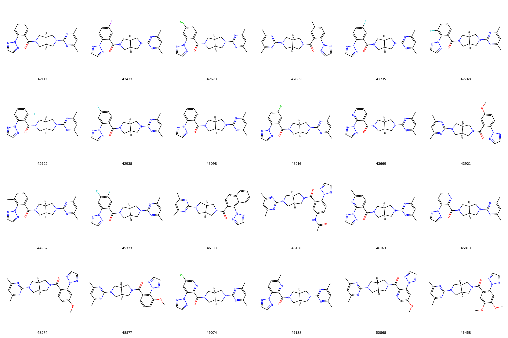
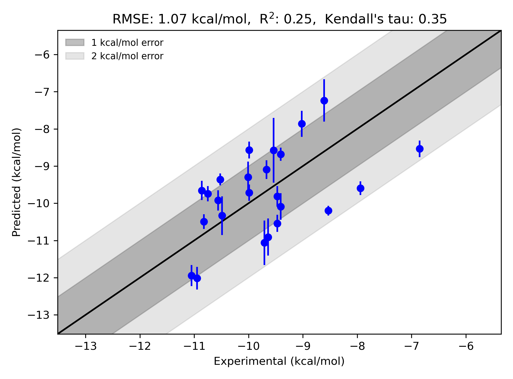

# GPCR|OX2-set2 System FEP Calculation Results Analysis

> This README is generated by AI model using verified experimental data and Uni-FEP calculation results. Content may contain inaccuracies and is provided for reference only. No liability is assumed for outcomes related to its use.

## Introduction

GPCR|OX2-set2 refers to the OX2 receptor (also known as Orexin receptor 2), a G-protein-coupled receptor (GPCR) involved in the regulation of sleep-wake cycles and feeding behavior. This receptor is part of the orexin signaling pathway, which plays a critical role in maintaining wakefulness, energy metabolism, and arousal. The OX2 receptor is particularly significant in the context of insomnia treatments, as antagonism of this receptor can promote sleep onset and maintenance. The receptor has become a vital target in drug discovery for its potential therapeutic applications in sleep disorders and related conditions.

## Molecules

The GPCR|OX2-set2 dataset includes 23 distinct ligands with measured binding free energies (experimental ΔG) ranging from -7.94 kcal/mol to -11.05 kcal/mol. These compounds share a common structural framework, with variations in substituents leading to differences in binding affinities. Structural diversity is introduced through substitutions such as halogens (e.g., fluorine and chlorine), methyl groups, and additional aromatic functionality on the scaffold. The combination of these chemical features contributes to the dataset's overall binding free energy range and is reflective of efforts to optimize receptor binding properties.

## Conclusions

The FEP calculation results for the GPCR|OX2-set2 system provide insights into the performance of the methodology. With an RMSE of 1.07 kcal/mol and an R² of 0.25, these results indicate that the calculations captured moderate agreement with experimental data. The predicted binding free energies spanned a similar range to experimental values, reflecting relative binding trends across the dataset.

Several ligands showed promising predictive performance. For example, ligand **42922** demonstrated excellent agreement between experimental and predicted ΔG values (experimental: -10.95 kcal/mol, predicted: -12.02 kcal/mol), highlighting the ability to accurately capture binding affinities for specific compounds. Similarly, ligand **49188** (experimental: -8.53 kcal/mol, predicted: -10.20 kcal/mol) displayed strong correspondence, showcasing the utility of computational predictions in supporting structure-based drug design efforts.

## References

Deflorian F, Perez-Benito L, Lenselink EB, Congreve M, van Vlijmen HW, Mason JS, Graaf CD, Tresadern G. Accurate prediction of GPCR ligand binding affinity with free energy perturbation. *Journal of Chemical Information and Modeling.* 2020 Jun 15;60(11):5563-79. [https://pubs.acs.org/doi/10.1021/acs.jcim.0c00449](https://pubs.acs.org/doi/10.1021/acs.jcim.0c00449)