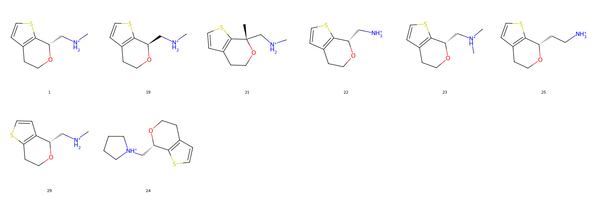
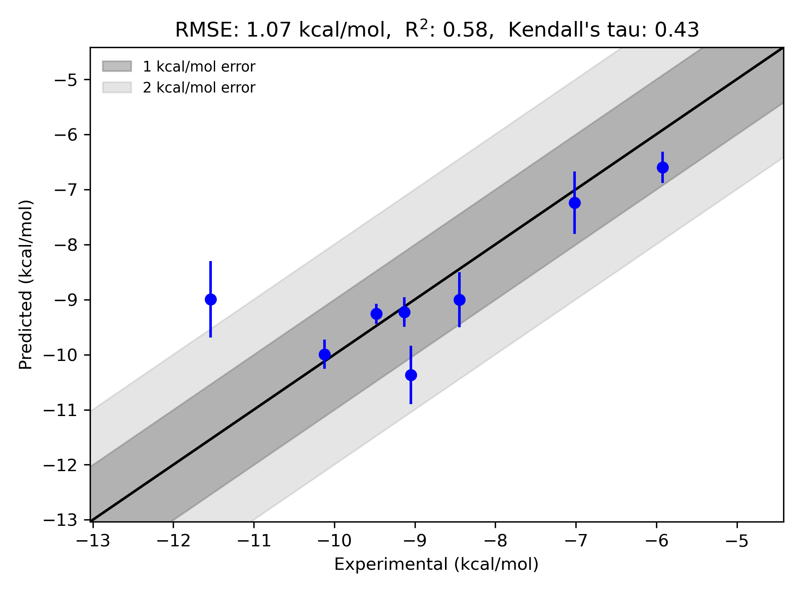

# GPCR TA1 System FEP Calculation Results Analysis

> This README is generated by an AI model using verified experimental data and Uni-FEP calculation results. Content may contain inaccuracies and is provided for reference only. No liability is assumed for outcomes related to its use.

## Introduction

TA1 (Trace Amine-Associated Receptor 1, TAAR1) belongs to the GPCR (G-protein-coupled receptor) family and plays a significant role in the regulation of neurotransmitter systems. TAAR1 is an intracellular receptor activated by trace amines, such as β-phenylethylamine, and has been implicated in the modulation of dopaminergic, serotonergic, and glutamatergic systems. TAAR1 has gained substantial interest as a therapeutic target for its potential role in treating neuropsychiatric disorders such as schizophrenia and depression, as well as metabolic disruptions such as diabetes and obesity. The receptor is unique as it is expressed primarily in intracellular compartments, and its pharmacology is being actively explored for clinical applications.

## Molecules

The GPCR TA1 system dataset in this study consists of eight compounds featuring a diverse range of chemical structures. These compounds include a variety of substituents at key positions to explore their effects on receptor binding. A majority of the molecules in the dataset include heterocyclic scaffolds, amine functionalities, and stereocenters, contributing to structural diversity and ligand-receptor specificity. 

The experimentally determined binding free energies for these compounds span a wide range, from -5.92 to -11.54 kcal/mol. The dataset reflects significant structural variations, providing an opportunity to evaluate and benchmark FEP methodologies for this target.

## Conclusions

The FEP calculation results for the GPCR TA1 system demonstrate reasonable alignment with experimental data, achieving an RMSE of 1.07 kcal/mol and an R² of 0.58. Notable compounds that demonstrated strong predictive accuracy include compound **1**, which had an experimental ΔG of -10.12 kcal/mol and a predicted ΔG of -9.99 kcal/mol, and compound **23**, with an experimental ΔG of -9.13 kcal/mol and a predicted ΔG of -9.23 kcal/mol. 

The calculated free energies broadly captured the relative binding affinities across the dataset, demonstrating the utility of the FEP methodology in studying ligand-receptor interactions for challenging GPCR systems.

## References

Deflorian F, Perez-Benito L, Lenselink EB, Congreve M, van Vlijmen HW, Mason JS, Graaf CD, Tresadern G. Accurate prediction of GPCR ligand binding affinity with free energy perturbation. *Journal of Chemical Information and Modeling.* 2020 Jun 15;60(11):5563-79. [https://pubs.acs.org/doi/10.1021/acs.jcim.0c00449](https://pubs.acs.org/doi/10.1021/acs.jcim.0c00449) 