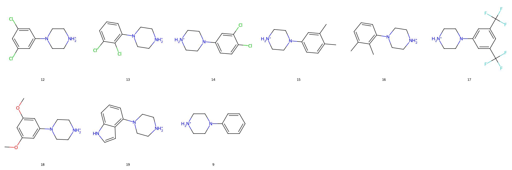
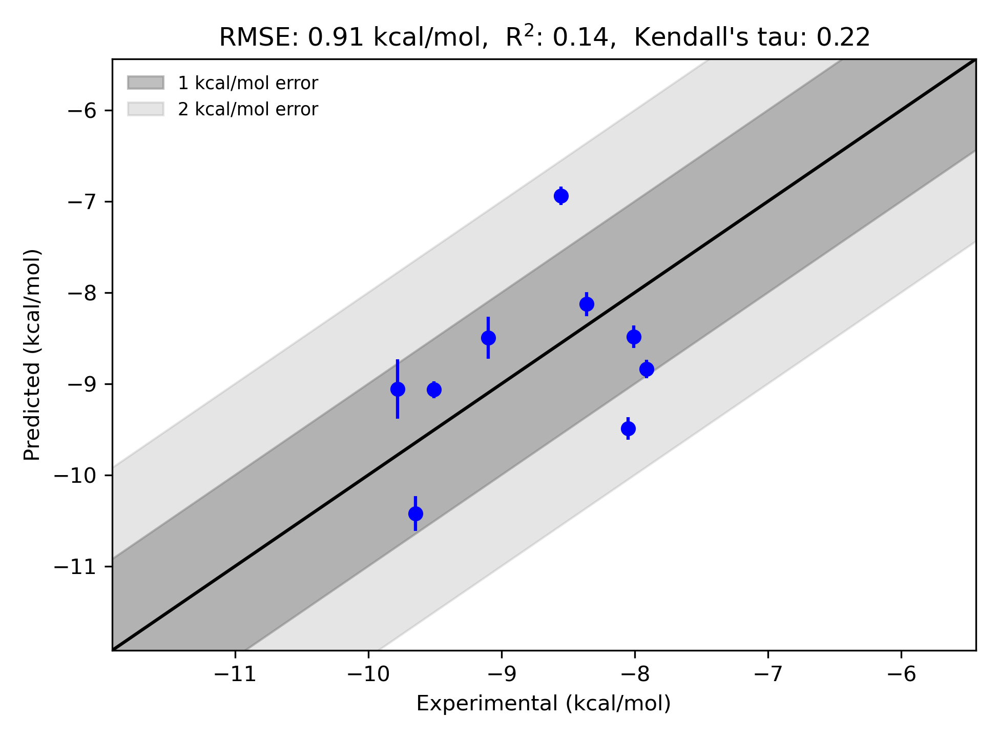

# GPCR|β1 System FEP Calculation Results Analysis

> This README is generated by AI model using verified experimental data and Uni-FEP calculation results. Content may contain inaccuracies and is provided for reference only. No liability is assumed for outcomes related to its use.

## Introduction

Beta-1 adrenergic receptor (β1-AR), part of the G protein-coupled receptor (GPCR) family, is predominantly found in cardiac tissue and plays a crucial role in regulating heart rate, contractility, and cardiac output. As a subtype of adrenergic receptors, β1-AR is activated by catecholamines such as adrenaline and noradrenaline, triggering intracellular signaling via G proteins. It is a critical therapeutic target for cardiovascular diseases, including hypertension and heart failure. β1-AR blockers, or beta-blockers, are widely prescribed for managing these conditions, making this receptor an important focus of pharmacological research.

## Molecules

The GPCR|β1 system dataset utilized in this study consists of 9 compounds, which feature diverse chemical structures tailored for interaction with the receptor. The compounds include halogenated aromatics, amino-functionalized scaffolds, and methyl-substituted derivatives, providing a representative range of molecules in the chemical space for β1-AR targeting.

The experimentally determined binding affinities cover a range of approximately 2 kcal/mol, spanning binding free energies from -7.91 to -9.78 kcal/mol. This dataset enables the evaluation of free energy perturbation (FEP) methodologies for accurately predicting ligand-receptor interactions within the GPCR|β1 system.

## Conclusions

The FEP calculation results for the GPCR|β1 system demonstrate reasonable alignment with the experimental data, with an RMSE of 0.91 kcal/mol and an R² of 0.14. Several compounds illustrate strong prediction performance, such as compound 12 (experimental: -9.645 kcal/mol, predicted: -10.423 kcal/mol) and compound 17 (experimental: -8.048 kcal/mol, predicted: -9.49 kcal/mol). These results suggest that FEP effectively captures key trends in relative binding free energies for this dataset.

## References

Deflorian F, Perez-Benito L, Lenselink EB, Congreve M, van Vlijmen HW, Mason JS, Graaf CD, Tresadern G. Accurate prediction of GPCR ligand binding affinity with free energy perturbation. *Journal of Chemical Information and Modeling*. 2020 Jun 15;60(11):5563-79. [https://pubs.acs.org/doi/10.1021/acs.jcim.0c00449](https://pubs.acs.org/doi/10.1021/acs.jcim.0c00449)