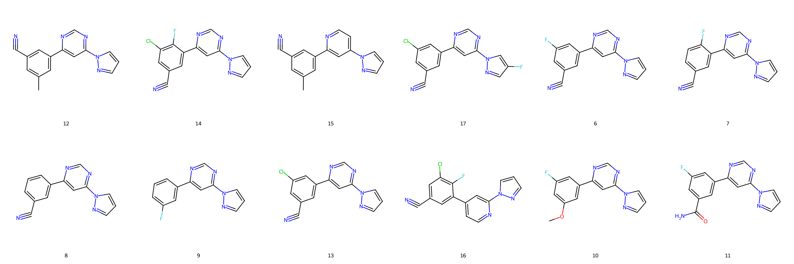
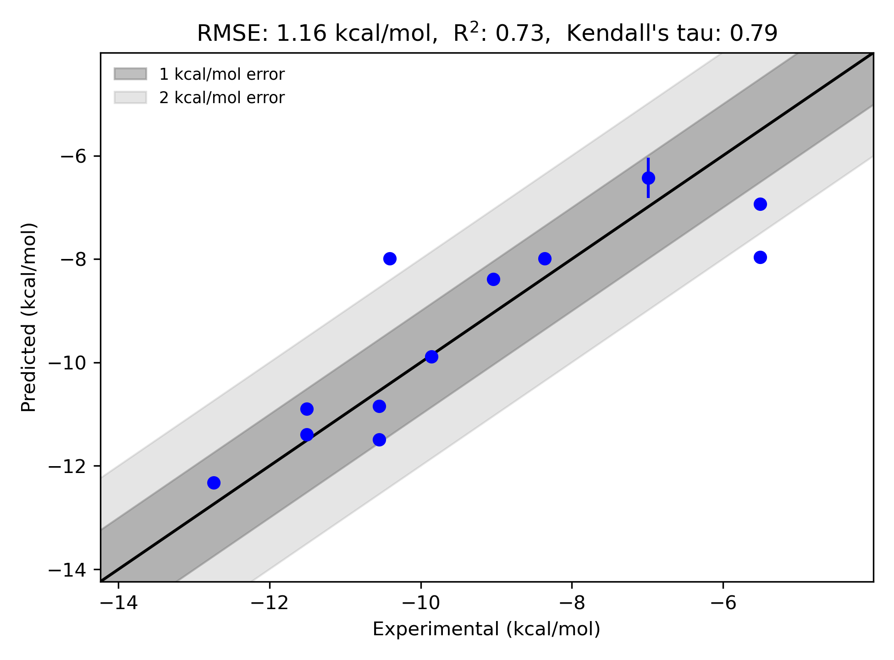

# GPCR|mGluR5 System FEP Calculation Results Analysis

> This README is generated by AI model using verified experimental data and Uni-FEP calculation results. Content may contain inaccuracies and is provided for reference only. No liability is assumed for outcomes related to its use.

## Introduction

Metabotropic glutamate receptor 5 (mGluR5) is a type of G-protein-coupled receptor (GPCR) that plays an integral role in the central nervous system. mGluR5 is involved in regulating synaptic plasticity, learning, and memory, and has been implicated in a range of neurological and psychiatric disorders. These disorders include Alzheimer's disease, Parkinson's disease, depression, and anxiety. The receptor is also linked to addiction, making it a potential therapeutic target for drug abuse treatment. mGluR5 modulates glutamate signaling and works in concert with other neurotransmitters to influence neuronal activity, making it a highly relevant target for novel pharmacological interventions.

## Molecules

The mGluR5 system dataset features 12 ligands with diverse structural characteristics designed to bind to the receptor effectively. These ligands exhibit a wide range of chemical modifications, including halogen substitutions (chlorine and fluorine) and functional groups such as methyl, nitrile, and hydroxyl moieties. This structural diversity provides a rich dataset for studying ligand-receptor interactions through free energy perturbation (FEP).

The experimentally determined binding free energies for the mGluR5 system span from -5.51 to -12.74 kcal/mol. This diversity demonstrates the wide range of binding affinities achieved by various ligand designs targeted to interact with mGluR5.

## Conclusions

The FEP calculation results for the mGluR5 target demonstrate strong predictive performance, with an RMSE of 1.16 kcal/mol and an R² value of 0.73, indicating moderate-to-high correlation between experimental and computational results. Several ligands stand out for their predictive accuracy. For example, ligand **14** showed excellent agreement, with experimental and predicted binding free energies of -12.74 kcal/mol and -12.324 kcal/mol, respectively. Ligand **13** also performed well, with experimental and predicted values of -11.51 kcal/mol and -11.395 kcal/mol. Both cases illustrate the capability of FEP calculations in capturing the relative binding free energy trends accurately for this target.

This dataset and predictive modeling approach exemplify the utility of free energy perturbation methods in studying GPCR-ligand interactions, particularly for highly relevant therapeutic targets like mGluR5.

## References

Deflorian F, Perez-Benito L, Lenselink EB, Congreve M, van Vlijmen HW, Mason JS, Graaf CD, Tresadern G. Accurate prediction of GPCR ligand binding affinity with free energy perturbation. *Journal of Chemical Information and Modeling*. 2020 Jun 15;60(11):5563-79. [https://pubs.acs.org/doi/10.1021/acs.jcim.0c00449](https://pubs.acs.org/doi/10.1021/acs.jcim.0c00449)