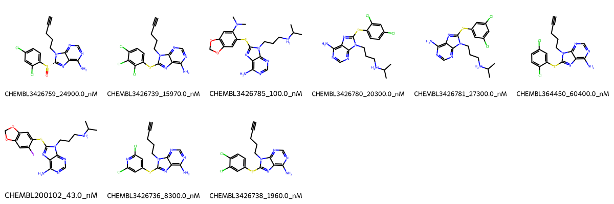

# HSP90AA1 System FEP Calculation Results Analysis

## Target Introduction

HSP90AA1 (Heat Shock Protein 90 Alpha Family Class A Member 1) is a molecular chaperone that plays a crucial role in protein folding, stability, and function. It is essential for the maturation and stability of various client proteins involved in cell signaling, survival, and proliferation. HSP90AA1 has emerged as an important therapeutic target in cancer treatment, as its inhibition can simultaneously disrupt multiple oncogenic pathways. The development of selective HSP90AA1 inhibitors has shown promise in treating various types of cancer.

## Dataset Analysis

The HSP90AA1 system dataset in this study comprises 9 compounds, featuring a purine-based scaffold with various thioether linkages to substituted phenyl rings. These compounds demonstrate structural diversity through different halogen substitutions (chloro, iodo) and structural modifications, including dioxolane rings and alkyne chains. A notable feature is the presence of basic amine-containing side chains that appear to contribute to binding affinity.

The experimentally determined binding affinities range from 43.0 nM to 60400 nM, spanning approximately three orders of magnitude, with binding free energies from -5.75 to -10.04 kcal/mol.

## Conclusions

The FEP calculation results for the HSP90AA1 system show moderate predictive performance with an R² of 0.62 and an RMSE of 0.99 kcal/mol. The predicted binding free energies (-4.50 to -10.30 kcal/mol) generally correlate with experimental values, though with some notable variations. Several compounds showed good prediction accuracy, such as CHEMBL200102 (experimental: -10.04 kcal/mol, predicted: -10.30 kcal/mol) and CHEMBL3426738 (experimental: -7.78 kcal/mol, predicted: -7.72 kcal/mol). The most potent compound, CHEMBL200102, with an experimental binding free energy of -10.04 kcal/mol, was well predicted at -10.30 kcal/mol.

## References

For more information about the HSP90AA1 target and associated bioactivity data, please visit:
https://www.ebi.ac.uk/chembl/explore/assay/CHEMBL3427922 