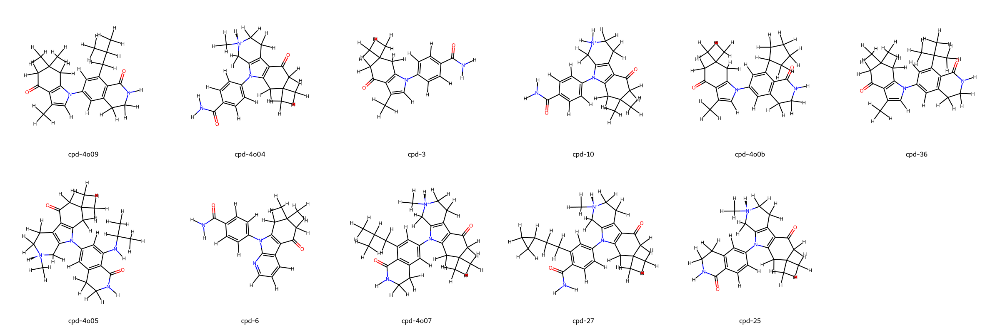

# HSP90 System FEP Calculation Results Analysis

> This README is generated by AI model using verified experimental data and Uni-FEP calculation results. Content may contain inaccuracies and is provided for reference only. No liability is assumed for outcomes related to its use.

## Introduction

Heat Shock Protein 90 (HSP90) is a molecular chaperone that plays a crucial role in protein folding, stability, and function. It is essential for the survival of cancer cells and has emerged as an important therapeutic target in oncology. HSP90 helps maintain the stability and function of various oncogenic proteins involved in cancer cell growth, survival, and metastasis. Inhibition of HSP90 has shown promise in treating various types of cancer by simultaneously disrupting multiple oncogenic pathways.

## Molecules

The HSP90 system dataset in this study consists of 11 compounds, featuring a complex tricyclic core structure with various substituents. The compounds share a common lactam-based scaffold and demonstrate structural diversity through different substitution patterns, including cycloalkyl groups and amide modifications. Notable structural features include N-methylated derivatives and various alkyl substituents that influence binding affinity.

The experimentally determined binding free energies span a range from -7.64 to -11.32 kcal/mol, representing a significant range of binding affinities that covers nearly 4 orders of magnitude in terms of binding constants.

## Conclusions

The FEP calculation results for the HSP90 system show good correlation with experimental data, achieving an R² of 0.71 and an RMSE of 1.29 kcal/mol. Several compounds demonstrated good prediction accuracy, such as compound cpd-4o09 (experimental: -10.50 kcal/mol, predicted: -10.41 kcal/mol) and compound cpd-4o0b (experimental: -11.32 kcal/mol, predicted: -11.77 kcal/mol). The predicted binding free energies ranged from -5.72 to -11.91 kcal/mol, effectively capturing the relative binding trends of the series.

## References

> Cappel D, Jerome S, Hessler G, Matter H. Impact of different automated binding pose generation approaches on relative binding free energy simulations. Journal of Chemical Information and Modeling. 2020 Jan 28;60(3):1432-44. 