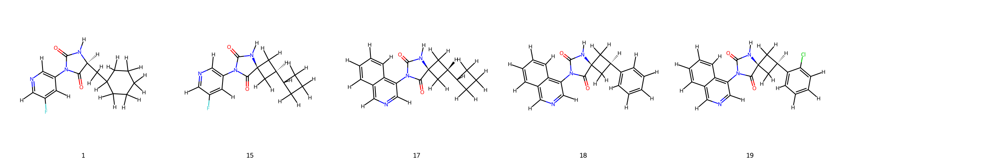
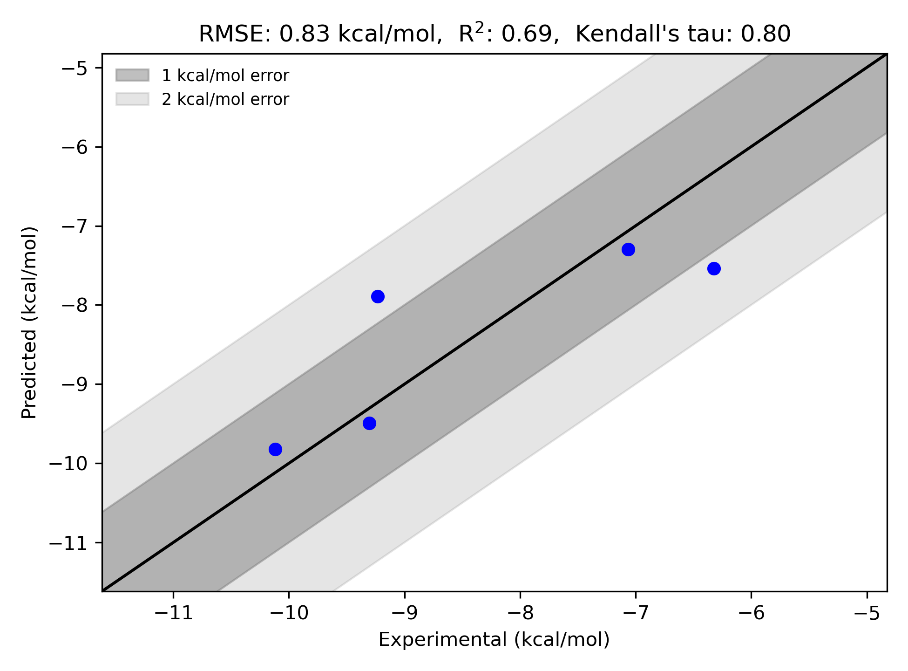

# 3CLPro System FEP Calculation Results Analysis

> This README is generated by AI model using verified experimental data and Uni-FEP calculation results. Content may contain inaccuracies and is provided for reference only. No liability is assumed for outcomes related to its use.

## Introduction

SARS-CoV-2 main protease (3CLPro), also known as Mpro, is a crucial enzyme in the viral life cycle of coronaviruses. It plays a vital role in processing viral polyproteins and is essential for viral replication. Due to its indispensable function in the viral life cycle and high conservation among coronaviruses, 3CLPro has emerged as an important therapeutic target for developing antiviral drugs against SARS-CoV-2 and other coronaviruses.

## Molecules

The 3CLPro system dataset in this study consists of 5 compounds, featuring diverse structural scaffolds. The compounds include both fluorinated pyridine-based structures and fused bicyclic systems. Notable structural variations include the incorporation of cyclopropyl and phenyl substituents, as well as different stereochemical configurations that influence binding affinity.

The experimentally determined binding free energies span a range from -6.33 to -10.12 kcal/mol, demonstrating a significant variation in binding affinity across the series.

## Conclusions

The FEP calculation results for the 3CLPro system demonstrate good correlation with experimental data, achieving an R² of 0.69 and an RMSE of 0.83 kcal/mol. Several compounds showed excellent prediction accuracy, particularly compound 17 (experimental: -9.31 kcal/mol, predicted: -9.49 kcal/mol) and compound 19 (experimental: -10.12 kcal/mol, predicted: -9.82 kcal/mol). The predicted binding free energies ranged from -7.30 to -9.82 kcal/mol, effectively capturing the relative binding trends of the series.

## References

> Luttens A, Gullberg H, Abdurakhmanov E, Vo DD, Akaberi D, Talibov VO, Nekhotiaeva N, Vangeel L, De Jonghe S, Jochmans D, Krambrich J. Ultralarge virtual screening identifies SARS-CoV-2 main protease inhibitors with broad-spectrum activity against coronaviruses. Journal of the American Chemical Society. 2022 Feb 10;144(7):2905-20. 