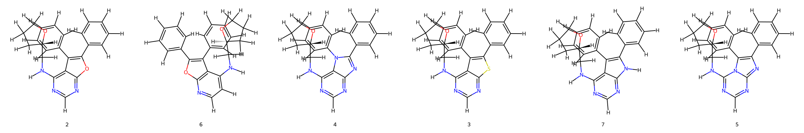
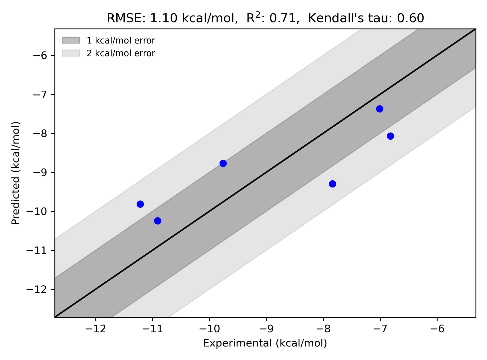

# ACK1 System FEP Calculation Results Analysis

> This README is generated by AI model using verified experimental data and Uni-FEP calculation results. Content may contain inaccuracies and is provided for reference only. No liability is assumed for outcomes related to its use.

## Introduction

Activated Cdc42-associated kinase 1 (ACK1) is a non-receptor tyrosine kinase that plays important roles in cell survival, migration, and cancer progression. It is activated by multiple receptor tyrosine kinases and has been implicated in various cancers, including prostate, breast, and pancreatic cancer. ACK1 has emerged as a promising therapeutic target in oncology due to its involvement in multiple signaling pathways that promote tumor growth and metastasis, with inhibitors showing potential in preclinical studies.

## Molecules

The ACK1 system dataset in this study consists of 6 compounds, featuring furo[2,3-d]pyrimidine and pyrrolo[2,3-d]pyrimidine core structures. The compounds share a common cyclopropylmethyl amine substituent and demonstrate structural diversity through different heterocyclic core modifications and biphenyl substituents. Notable structural features include variations in the central heterocyclic system that influence binding affinity.

The experimentally determined binding free energies span a range from -6.82 to -11.22 kcal/mol, representing a significant range of binding affinities that covers nearly 4.5 orders of magnitude in terms of binding constants.

## Conclusions

The FEP calculation results for the ACK1 system show good correlation with experimental data, achieving an R² of 0.71 and an RMSE of 1.10 kcal/mol. Several compounds demonstrated good prediction accuracy, such as compound 2 (experimental: -10.91 kcal/mol, predicted: -10.24 kcal/mol) and compound 4 (experimental: -7.01 kcal/mol, predicted: -7.37 kcal/mol). The predicted binding free energies ranged from -7.37 to -10.24 kcal/mol, effectively capturing the relative binding trends of the series.

## References

> Jiao X, Kopecky DJ, Liu J, Liu J, Jaen JC, Cardozo MG, Sharma R, Walker N, Wesche H, Li S, Farrelly E. Synthesis and optimization of substituted furo [2, 3-d]-pyrimidin-4-amines and 7H-pyrrolo [2, 3-d] pyrimidin-4-amines as ACK1 inhibitors. Bioorganic & medicinal chemistry letters. 2012; 22(19):6212-7. 