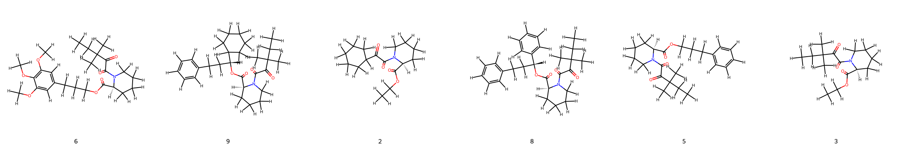
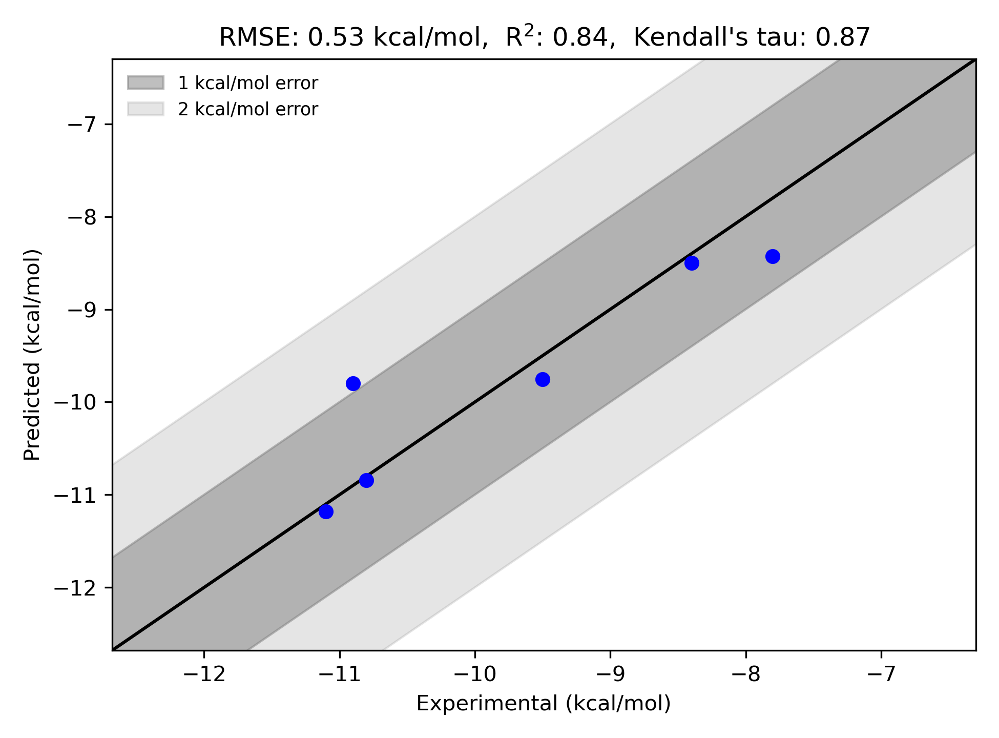

# FKBP12 System FEP Calculation Results Analysis

> This README is generated by AI model using verified experimental data and Uni-FEP calculation results. Content may contain inaccuracies and is provided for reference only. No liability is assumed for outcomes related to its use.

## Introduction

FK506-binding protein 12 (FKBP12) is a peptidyl-prolyl cis-trans isomerase that plays crucial roles in protein folding and cellular signaling. It is particularly important as the primary intracellular receptor for immunosuppressive drugs such as FK506 (tacrolimus) and rapamycin. FKBP12 forms complexes with these drugs that then inhibit key signaling pathways in T-cells, leading to immunosuppression. Due to its central role in immunosuppression and involvement in various cellular processes, FKBP12 has emerged as an important therapeutic target for developing immunosuppressive and other therapeutic agents.

## Molecules

The FKBP12 system dataset in this study consists of 6 compounds, featuring a pipecolate core structure with various substituents. The compounds share a common diketo-piperidine scaffold and demonstrate structural diversity through different modifications, including various alkyl chains and aromatic substituents. Notable structural features include the presence of trimethoxyphenyl groups and different ester linkages that influence binding affinity.

The experimentally determined binding free energies span a range from -7.80 to -11.10 kcal/mol, representing a significant range of binding affinities that covers more than 3 orders of magnitude in terms of binding constants.

## Conclusions

The FEP calculation results for the FKBP12 system show excellent correlation with experimental data, achieving an R² of 0.84 and an RMSE of 0.53 kcal/mol. Several compounds demonstrated remarkable prediction accuracy, such as compound 6 (experimental: -10.80 kcal/mol, predicted: -10.85 kcal/mol) and compound 9 (experimental: -11.10 kcal/mol, predicted: -11.18 kcal/mol). The predicted binding free energies ranged from -8.43 to -11.18 kcal/mol, effectively capturing the relative binding trends of the series.

## References

> Wang J, Deng Y, Roux B. Absolute binding free energy calculations using molecular dynamics simulations with restraining potentials. Biophysical journal. 2006;91(8):2798-814. 