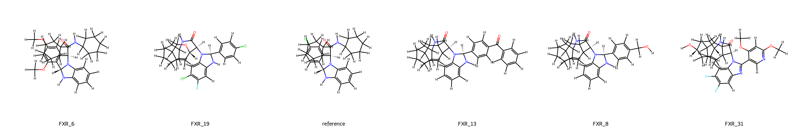
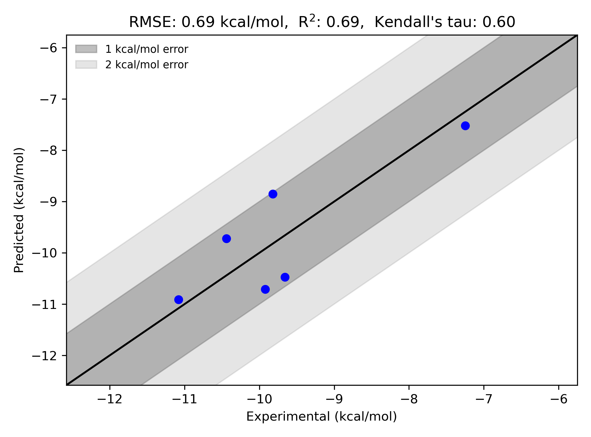

# FXR System FEP Calculation Results Analysis

> This README is generated by AI model using verified experimental data and Uni-FEP calculation results. Content may contain inaccuracies and is provided for reference only. No liability is assumed for outcomes related to its use.

## Introduction

Farnesoid X Receptor (FXR) is a nuclear receptor that functions as a key regulator of bile acid homeostasis, lipid and glucose metabolism. It plays crucial roles in maintaining metabolic homeostasis and has emerged as an important therapeutic target for various metabolic disorders, including non-alcoholic steatohepatitis (NASH), primary biliary cholangitis (PBC), and type 2 diabetes. FXR activation has been shown to have beneficial effects on these conditions through its regulation of metabolic pathways.

## Molecules

The FXR system dataset in this study consists of 6 compounds, featuring diverse structural scaffolds with benzimidazole and indole-based cores. The compounds demonstrate significant structural variation through different substitution patterns, including chloro, fluoro, and methoxy groups. Notable structural features include cyclohexyl amide moieties and various cyclic systems that contribute to binding affinity.

The experimentally determined binding free energies span a range from -7.25 to -11.08 kcal/mol, representing a significant range of binding affinities that covers nearly 4 orders of magnitude in terms of binding constants.

## Conclusions

The FEP calculation results for the FXR system show good correlation with experimental data, achieving an R² of 0.69 and an RMSE of 0.69 kcal/mol. Several compounds demonstrated good prediction accuracy, such as compound FXR_8 (experimental: -7.25 kcal/mol, predicted: -7.52 kcal/mol) and compound FXR_31 (experimental: -11.08 kcal/mol, predicted: -10.91 kcal/mol). The predicted binding free energies ranged from -7.52 to -10.91 kcal/mol, effectively capturing the relative binding trends of the series.

## References

> Athanasiou C, Vasilakaki S, Dellis D, Cournia Z. Using physics-based pose predictions and free energy perturbation calculations to predict binding poses and relative binding affinities for FXR ligands in the D3R Grand Challenge 2. Journal of computer-aided molecular design. 2018 Jan;32(1):21-44. 