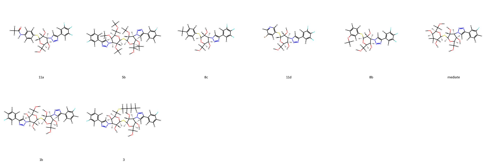
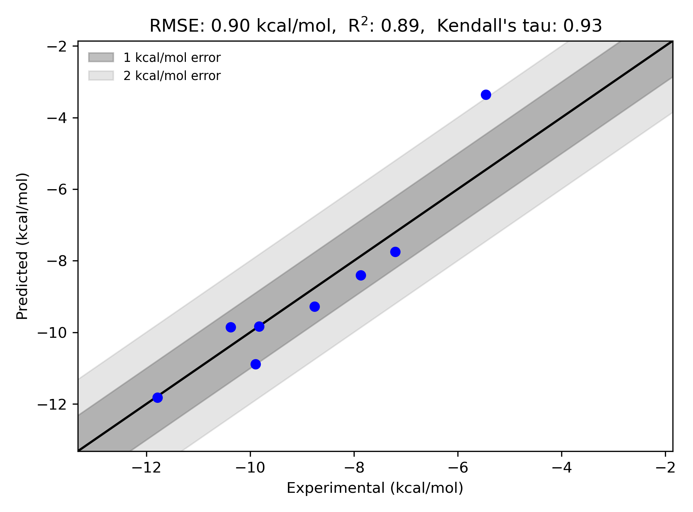

# Galectin-3 System FEP Calculation Results Analysis

> This README is generated by AI model using verified experimental data and Uni-FEP calculation results. Content may contain inaccuracies and is provided for reference only. No liability is assumed for outcomes related to its use.

## Introduction

Galectin-3 is a β-galactoside-binding protein that plays crucial roles in various biological processes, including inflammation, fibrosis, and cancer progression. It is particularly important in the development and progression of fibrotic diseases, where its increased expression correlates with disease severity. As a key mediator of fibrosis in multiple organs, Galectin-3 has emerged as an important therapeutic target for the treatment of fibrotic diseases, with inhibitors showing promise in preclinical and clinical studies.

## Molecules

The Galectin-3 system dataset in this study consists of 8 compounds, featuring complex carbohydrate-based structures with various modifications. The compounds share a common triazole-containing scaffold and demonstrate structural diversity through different substitution patterns, including fluorinated aromatics and thioether linkages. Notable structural features include various glycosidic modifications and different aromatic substituents that influence binding affinity.

The experimentally determined binding free energies span a range from -5.46 to -11.78 kcal/mol, representing a significant range of binding affinities that covers more than 6 orders of magnitude in terms of binding constants.

## Conclusions

The FEP calculation results for the Galectin-3 system show excellent correlation with experimental data, achieving an R² of 0.89 and an RMSE of 0.90 kcal/mol. Several compounds demonstrated remarkable prediction accuracy, such as compound 1b (experimental: -11.78 kcal/mol, predicted: -11.82 kcal/mol) and the mediate compound (experimental: -9.83 kcal/mol, predicted: -9.83 kcal/mol). The predicted binding free energies ranged from -3.36 to -11.82 kcal/mol, effectively capturing the relative binding trends of the series.

## References

> Zetterberg FR, MacKinnon A, Brimert T, Gravelle L, Johnsson RE, Kahl-Knutson B, Leffler H, Nilsson UJ, Pedersen A, Peterson K, Roper JA. Discovery and optimization of the first highly effective and orally available galectin-3 inhibitors for treatment of fibrotic disease. Journal of Medicinal Chemistry. 2022 Sep 26;65(19):12626-38. 