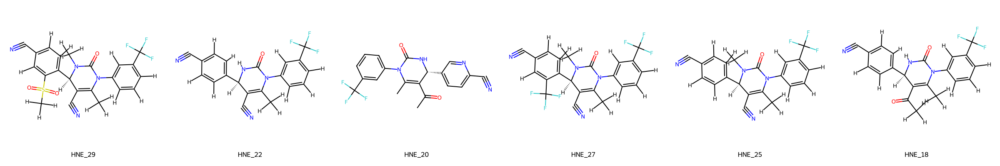
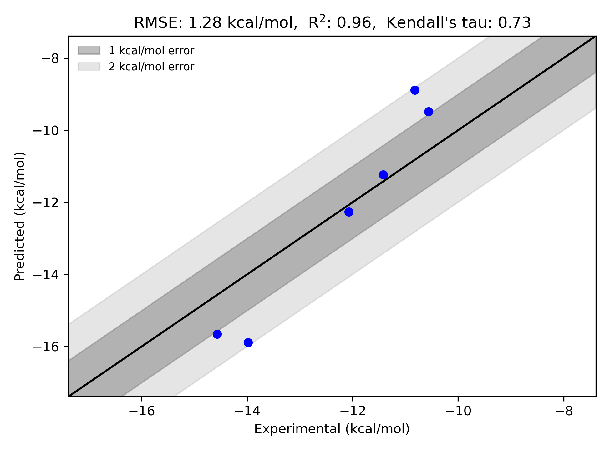

# HNE System FEP Calculation Results Analysis

> This README is generated by AI model using verified experimental data and Uni-FEP calculation results. Content may contain inaccuracies and is provided for reference only. No liability is assumed for outcomes related to its use.

## Introduction

Human Neutrophil Elastase (HNE) is a serine protease primarily expressed in neutrophils that plays a crucial role in host defense and inflammatory responses. However, its dysregulation can lead to tissue damage in various pulmonary diseases, including chronic obstructive pulmonary disease (COPD), cystic fibrosis, and acute lung injury. Due to its involvement in these pathological conditions, HNE has emerged as an important therapeutic target for the treatment of pulmonary diseases, with inhibitors showing promise in reducing inflammation and preventing tissue damage.

## Molecules

The HNE system dataset in this study consists of 6 compounds, featuring a pyrimidinone core structure with various substituents. The compounds share a common trifluoromethylphenyl moiety and demonstrate structural diversity through different modifications, including cyano groups and various N-substitution patterns. Notable structural features include the presence of electron-withdrawing groups and strategically placed substituents that influence binding affinity.

The experimentally determined binding free energies span a range from -10.56 to -14.57 kcal/mol, representing a significant range of binding affinities that covers nearly 4 orders of magnitude in terms of binding constants.

## Conclusions

The FEP calculation results for the HNE system show excellent correlation with experimental data, achieving an R² of 0.96 and an RMSE of 1.28 kcal/mol. Several compounds demonstrated good prediction accuracy, such as compound HNE_22 (experimental: -11.42 kcal/mol, predicted: -11.24 kcal/mol) and compound HNE_25 (experimental: -12.07 kcal/mol, predicted: -12.27 kcal/mol). The predicted binding free energies ranged from -8.89 to -15.89 kcal/mol, effectively capturing the relative binding trends of the series.

## References

> von Nussbaum F, Li VM, Allerheiligen S, Anlauf S, Bärfacker L, Bechem M, Delbeck M, Fitzgerald MF, Gerisch M, Gielen‐Haertwig H, Haning H. Freezing the bioactive conformation to boost potency: The identification of BAY 85‐8501, a Selective and Potent Inhibitor of Human Neutrophil Elastase for Pulmonary Diseases. ChemMedChem. 2015 Jul;10(7):1163-73. 