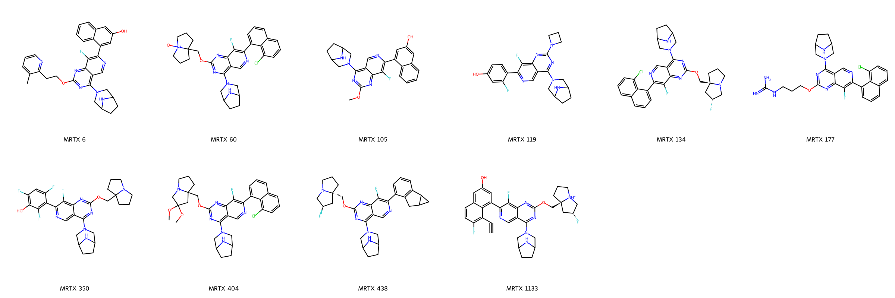

# KRAS-G12D System FEP Calculation Results Analysis

> This README is generated by AI model using verified experimental data and Uni-FEP calculation results. Content may contain inaccuracies and is provided for reference only. No liability is assumed for outcomes related to its use.

## Introduction

KRAS G12D is a specific mutant form of the KRAS protein, one of the most frequently mutated oncogenes in human cancers. The G12D mutation leads to constitutive activation of KRAS, driving uncontrolled cell growth and survival. This mutation is particularly prevalent in pancreatic cancer, where it occurs in approximately 90% of cases, and is also found in significant proportions of colorectal and lung cancers. Due to its central role in cancer development and progression, KRAS G12D has been a highly sought-after therapeutic target, though it has historically been considered "undruggable."

## Molecules

The KRAS-G12D system dataset in this study consists of 10 compounds, featuring complex heterocyclic structures with multiple ring systems. The compounds share a common pyrimidine core with a bispiperidine motif and demonstrate structural diversity through various substituents, including fluorinated aromatics and different cyclic amine modifications. Notable structural features include the presence of fused ring systems and strategically placed hydrogen bond donors and acceptors.

The experimentally determined binding free energies span a range from -7.39 to -12.81 kcal/mol, representing a significant range of binding affinities that covers more than 5 orders of magnitude in terms of binding constants.

## Conclusions

The FEP calculation results for the KRAS-G12D system show excellent correlation with experimental data, achieving an R² of 0.91 and an RMSE of 0.76 kcal/mol. Several compounds demonstrated remarkable prediction accuracy, such as compound MRTX 350 (experimental: -7.39 kcal/mol, predicted: -7.30 kcal/mol) and compound MRTX 1133 (experimental: -12.81 kcal/mol, predicted: -13.68 kcal/mol). The predicted binding free energies ranged from -6.87 to -13.68 kcal/mol, effectively capturing the relative binding trends of the series.

## References

> Wang X, Allen S, Blake JF, Bowcut V, Briere DM, Calinisan A, Dahlke JR, Fell JB, Fischer JP, Gunn RJ, Hallin J. Identification of MRTX1133, a noncovalent, potent, and selective KRASG12D inhibitor. Journal of medicinal chemistry. 2021 Dec 10;65(4):3123-33. 