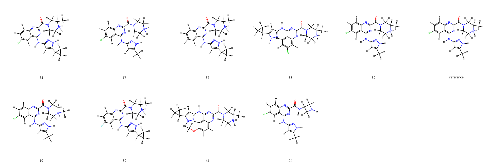

# PAK4 System FEP Calculation Results Analysis

> This README is generated by AI model using verified experimental data and Uni-FEP calculation results. Content may contain inaccuracies and is provided for reference only. No liability is assumed for outcomes related to its use.

## Introduction

p21-activated kinase 4 (PAK4) is a serine/threonine kinase that belongs to the PAK family of proteins. It plays crucial roles in various cellular processes including cytoskeletal reorganization, cell survival, and oncogenic transformation. PAK4 has been implicated in multiple cancer types, where its overexpression often correlates with poor prognosis. As a result, PAK4 has emerged as an important therapeutic target in cancer treatment, particularly for developing selective kinase inhibitors.

## Molecules

The PAK4 system dataset in this study consists of 10 compounds, featuring a quinazoline core structure with various substituents. The compounds share a common pyrazole moiety as a key recognition element, and demonstrate structural diversity through different substitution patterns, including chloro, fluoro, and methoxy groups. Notable variations include cyclopropyl and methyl substituents on the pyrazole ring, as well as different amine-containing side chains.

The experimentally determined binding free energies span a range from -8.33 to -11.13 kcal/mol, representing a significant range of binding affinities that covers nearly 3 orders of magnitude in terms of binding constants.

## Conclusions

The FEP calculation results for the PAK4 system show good correlation with experimental data, achieving an R² of 0.66 and an RMSE of 0.58 kcal/mol. Several compounds demonstrated good prediction accuracy, such as compound 19 (experimental: -8.34 kcal/mol, predicted: -8.75 kcal/mol) and the reference compound (experimental: -9.95 kcal/mol, predicted: -9.54 kcal/mol). The predicted binding free energies ranged from -8.75 to -11.41 kcal/mol, effectively capturing the relative binding trends of the series.

## References

> Hao C, Zhao F, Song H, Guo J, Li X, Jiang X, Huan R, Song S, Zhang Q, Wang R, Wang K. Structure-based design of 6-chloro-4-aminoquinazoline-2-carboxamide derivatives as potent and selective p21-activated kinase 4 (PAK4) inhibitors. Journal of medicinal chemistry. 2018 Jan 11;61(1):265-85. 