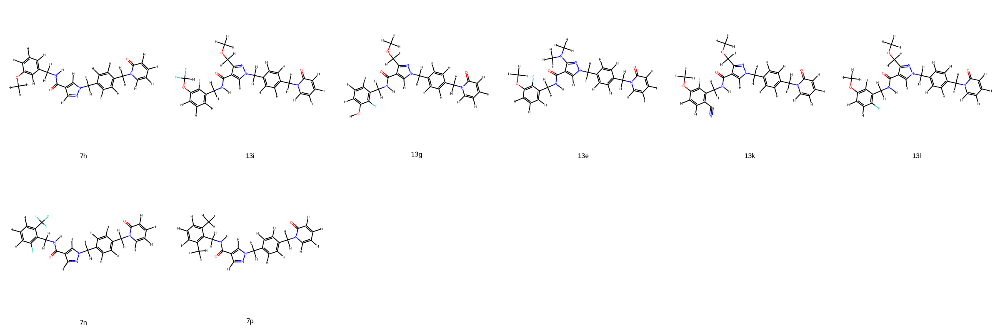

# Plasma Kallikrein (PKa) System FEP Calculation Results Analysis

> This README is generated by AI model using verified experimental data and Uni-FEP calculation results. Content may contain inaccuracies and is provided for reference only. No liability is assumed for outcomes related to its use.

## Introduction

Plasma Kallikrein (PKa) is a serine protease that plays a crucial role in the contact activation pathway of coagulation and the kallikrein-kinin system. It is particularly important in the context of hereditary angioedema (HAE), where its dysregulation leads to excessive bradykinin production and potentially life-threatening swelling episodes. Inhibition of plasma kallikrein has emerged as a validated therapeutic approach for the treatment of HAE.

## Molecules

The PKa system dataset in this study consists of 9 compounds, featuring a pyrazole core structure with diverse substituents. The compounds share a common indolin-2-one moiety connected through a methylene linker, and demonstrate structural variations primarily in the aryl substituents, including different fluorination patterns, methoxy groups, and cyano substitutions.

The experimentally determined binding free energies span a range from -8.67 to -12.28 kcal/mol, representing a significant range of binding affinities that covers nearly 4 orders of magnitude in terms of binding constants.

## Conclusions

The FEP calculation results for the PKa system show excellent correlation with experimental data, achieving an R² of 0.87 and an RMSE of 0.51 kcal/mol. Several compounds demonstrated remarkable prediction accuracy, such as compound 7h (experimental: -9.61 kcal/mol, predicted: -9.68 kcal/mol) and compound 13l (experimental: -10.17 kcal/mol, predicted: -10.24 kcal/mol). The predicted binding free energies ranged from -9.16 to -11.19 kcal/mol, effectively capturing the relative binding trends of the series.

## References

> Davie RL, Edwards HJ, Evans DM, Hodgson ST, Stocks MJ, Smith AJ, Rushbrooke LJ, Pethen SJ, Roe MB, Clark DE, McEwan PA. Sebetralstat (KVD900): A potent and selective small molecule plasma kallikrein inhibitor featuring a novel P1 group as a potential oral on-demand treatment for hereditary angioedema. Journal of Medicinal Chemistry. 2022 Oct 17;65(20):13629-44. 