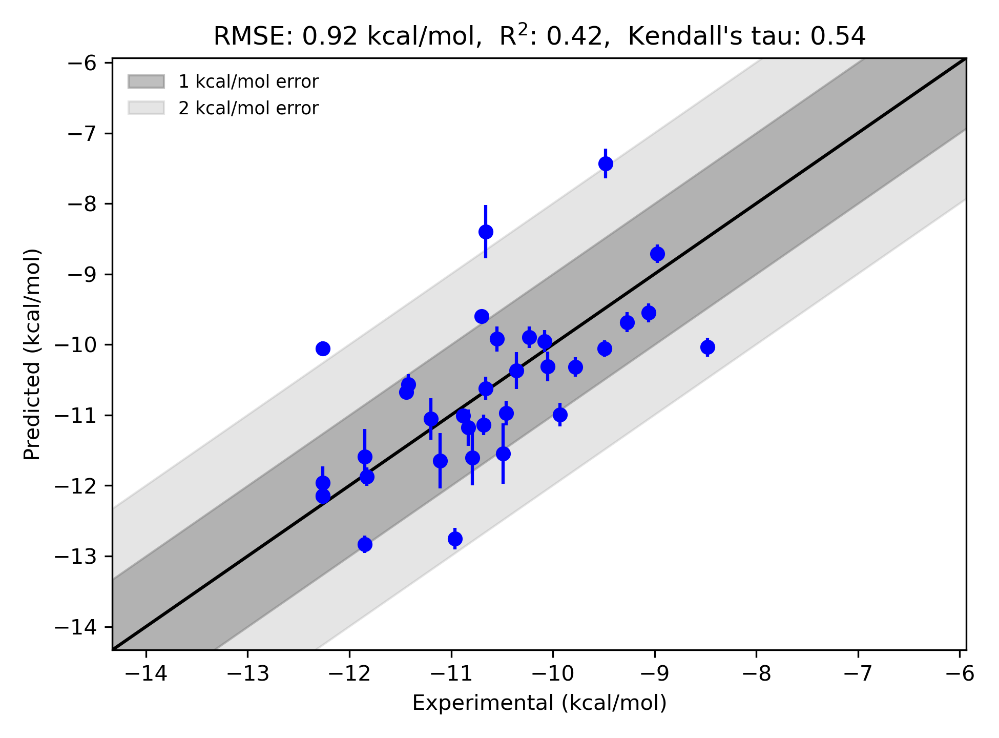

# P38 System FEP Calculation Results Analysis

> This README is generated by AI model using verified experimental data and Uni-FEP calculation results. Content may contain inaccuracies and is provided for reference only. No liability is assumed for outcomes related to its use.

## Introduction

P38 MAPK (P38 Mitogen-Activated Protein Kinase) is an important member of the MAPK family, functioning as a stress-activated protein kinase that plays crucial roles in multiple physiological processes including inflammatory response, cell differentiation, apoptosis, and cell cycle regulation. Abnormal activation of the P38 MAPK signaling pathway is closely associated with various diseases, including inflammatory diseases, autoimmune disorders, cardiovascular diseases, and cancer. Particularly in inflammatory diseases, P38 MAPK plays a vital role by regulating the production of pro-inflammatory cytokines. Therefore, P38 MAPK has become an important target for anti-inflammatory drug development, making the development of its inhibitors clinically significant.

## Molecules

The P38 system dataset in this study comprises 34 compounds, all ATP-competitive inhibitors, with molecular weights ranging from 350 to 500 Da. The compounds are mainly pyrazole and pyrimidine derivatives sharing similar core scaffolds while exhibiting significant structural diversity in peripheral substituents. These compounds feature key structural characteristics complementary to the P38 ATP binding site, including heterocyclic systems forming hydrogen bonds with hinge region residues, hydrophobic aromatic rings occupying the ATP binding pocket, and variable substituents extending into the DFG domain.

The experimentally determined binding free energies range from -8.48 to -12.26 kcal/mol.

## Conclusions

The FEP calculation results for the P38 system show that the predicted values (-7.43 to -12.83 kcal/mol) align with the experimental range. The overall prediction accuracy achieved an R² of 0.42 and an RMSE of 0.92 kcal/mol. Several compounds demonstrated excellent prediction results, such as compound 3fmk (experimental: -11.83 kcal/mol, predicted: -11.87 kcal/mol) and compound 2g (experimental: -10.66 kcal/mol, predicted: -10.62 kcal/mol). Good prediction accuracy was also observed for the structurally complex compound 2z (experimental: -10.36 kcal/mol, predicted: -10.37 kcal/mol). 