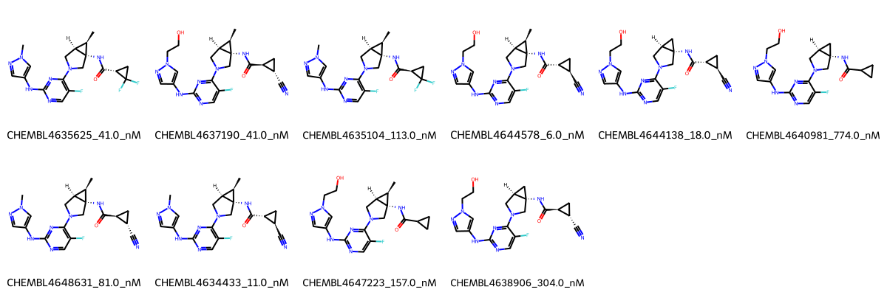

# JAK1 System FEP Calculation Results Analysis

## Target Introduction

JAK1 (Janus Kinase 1) is a non-receptor tyrosine kinase that plays a crucial role in cytokine signaling pathways, particularly in the JAK-STAT pathway. It is essential for mediating cellular responses to various inflammatory cytokines and growth factors. JAK1 has emerged as an important therapeutic target for treating autoimmune disorders, inflammatory diseases, and certain types of cancer. The development of selective JAK1 inhibitors represents a significant approach in modern medicine, as they can modulate specific inflammatory pathways while potentially minimizing off-target effects.

## Dataset Analysis

The JAK1 system dataset in this study comprises 10 compounds, featuring a complex scaffold with a fluoropyrimidine core connected to a cyclopropane-containing ring system. These compounds demonstrate structural diversity through various substituents, including hydroxyethyl-pyrazole groups and different cyclopropyl amide modifications. A notable feature is the presence of cyano and fluoro substituents that appear to be important for binding affinity.

The experimentally determined binding affinities range from 6.0 nM to 774.0 nM, spanning approximately two orders of magnitude, with binding free energies from -8.33 to -11.21 kcal/mol.

## Conclusions

The FEP calculation results for the JAK1 system show good predictive performance with an R² of 0.65 and an RMSE of 0.51 kcal/mol. The predicted binding free energies (-8.72 to -11.07 kcal/mol) generally correlate well with experimental values. Several compounds showed excellent prediction accuracy, such as CHEMBL4638906 (experimental: -8.89 kcal/mol, predicted: -8.82 kcal/mol) and CHEMBL4647223 (experimental: -9.28 kcal/mol, predicted: -9.40 kcal/mol). The most potent compound, CHEMBL4644578, with an experimental binding free energy of -11.21 kcal/mol, was well predicted at -10.69 kcal/mol.

## References

For more information about the JAK1 target and associated bioactivity data, please visit:
https://www.ebi.ac.uk/chembl/explore/assay/CHEMBL4620434 