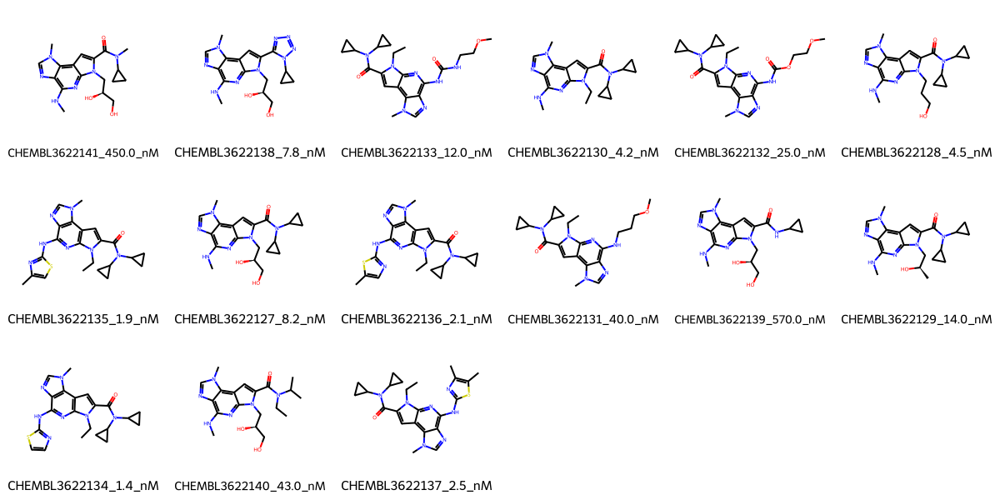

# JAK2 System FEP Calculation Results Analysis

> This README is generated by AI model using verified experimental data and Uni-FEP calculation results. Content may contain inaccuracies and is provided for reference only. No liability is assumed for outcomes related to its use.

## Introduction

JAK2 (Janus Kinase 2) is a non-receptor tyrosine kinase that plays a crucial role in various cellular processes, including cell growth, development, and immune function. It is a key component of the JAK-STAT signaling pathway, which is essential for the signal transduction of many cytokines and growth factors. JAK2 has emerged as an important therapeutic target, particularly in myeloproliferative disorders and various types of cancer, where mutations or dysregulation of JAK2 contribute to disease progression. The development of selective JAK2 inhibitors represents a significant approach in treating these conditions.

## Molecules

The JAK2 system dataset in this study comprises 15 compounds, featuring a complex tricyclic core structure with various substituents. These compounds demonstrate structural diversity through different modifications, including cyclopropyl amides, thiophene rings, and various polar groups such as hydroxyethyl and methoxyethyl chains. A notable feature is the presence of methylamine substituents that appear to be important for binding affinity.

The experimentally determined binding affinities range from 1.4 nM to 570.0 nM, spanning approximately three orders of magnitude, with binding free energies from -8.51 to -12.07 kcal/mol.

## Conclusions

The FEP calculation results for the JAK2 system show moderate predictive performance with an R² of 0.42 and an RMSE of 0.84 kcal/mol. The predicted binding free energies (-8.76 to -12.20 kcal/mol) generally correlate with experimental values, though with some variations. Several compounds showed good prediction accuracy, such as CHEMBL3622134 (experimental: -12.07 kcal/mol, predicted: -11.93 kcal/mol) and CHEMBL3622137 (experimental: -11.73 kcal/mol, predicted: -11.61 kcal/mol). The most potent compound, CHEMBL3622134, with an experimental binding free energy of -12.07 kcal/mol, was well predicted at -11.93 kcal/mol.

## References

For more information about the JAK2 target and associated bioactivity data, please visit:
https://www.ebi.ac.uk/chembl/explore/assay/CHEMBL3625473 