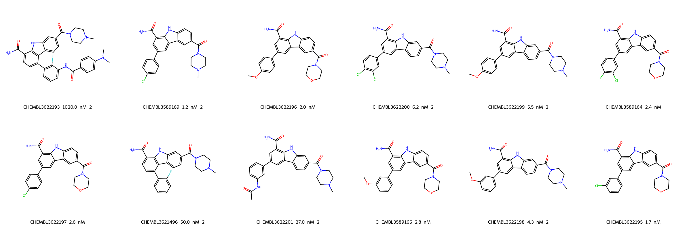

# JAK2 System FEP Calculation Results Analysis

> This README is generated by AI model using verified experimental data and Uni-FEP calculation results. Content may contain inaccuracies and is provided for reference only. No liability is assumed for outcomes related to its use.

## Introduction

JAK2 (Janus Kinase 2) is a non-receptor tyrosine kinase that plays a crucial role in various cytokine signaling pathways, particularly those involved in cell growth, development, and immune response. It is a key mediator of signal transduction for various growth factors and cytokines, including erythropoietin and thrombopoietin. JAK2 has emerged as an important therapeutic target for myeloproliferative disorders and various types of cancer, particularly due to the frequent occurrence of activating mutations in hematological malignancies.

## Molecules

The JAK2 system dataset in this study consists of 12 compounds, featuring a core structure with a 1H-pyrrolo[2,3-b]quinoxaline scaffold. The compounds share a common carboxamide group and demonstrate structural diversity through various substituents on the phenyl ring, including halogens (Cl, F), methoxy groups, and N,N-dimethylaniline derivatives. These molecules also show variation in their piperazine or morpholine amide substituents.

The experimentally determined binding affinities range from 1.2 nM to 1020 nM, spanning approximately three orders of magnitude, with binding free energies from -8.17 to -12.16 kcal/mol.

## Conclusions

The FEP calculation results for the JAK2 system show good correlation with experimental data, achieving an R² of 0.60 and an RMSE of 0.69 kcal/mol. Several compounds demonstrated excellent prediction accuracy, such as CHEMBL3622195 (experimental: -11.96 kcal/mol, predicted: -12.05 kcal/mol) and CHEMBL3622198 (experimental: -11.41 kcal/mol, predicted: -11.53 kcal/mol). The predicted binding free energies ranged from -9.60 to -12.24 kcal/mol, showing good agreement with the experimental range, particularly for compounds with halogen substituents.

## References

For more information about the JAK2 target and associated bioactivity data, please visit:
https://www.ebi.ac.uk/chembl/explore/assay/CHEMBL3627422 