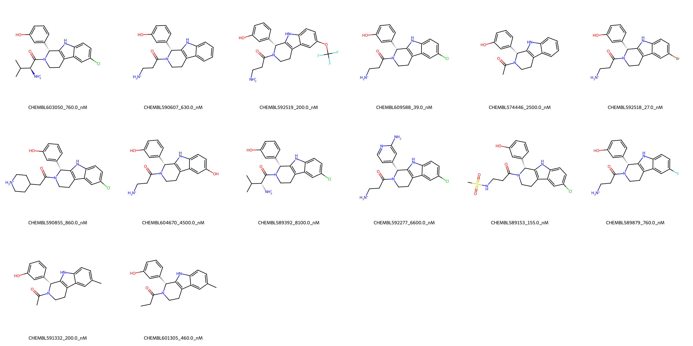

# KIF11 System FEP Calculation Results Analysis

> This README is generated by AI model using verified experimental data and Uni-FEP calculation results. Content may contain inaccuracies and is provided for reference only. No liability is assumed for outcomes related to its use.

## Introduction

KIF11 (Kinesin Family Member 11), also known as Eg5 or KSP, is a motor protein that plays a crucial role in mitotic spindle assembly and maintenance during cell division. It is responsible for the separation of duplicated centrosomes and the formation of the bipolar mitotic spindle. KIF11 has emerged as an important therapeutic target in cancer treatment due to its essential role in cell division and its overexpression in various types of cancer.

## Molecules

The KIF11 system dataset in this study consists of 14 compounds, featuring a core structure with a 1,2,3,4-tetrahydro-1H-pyrido[3,4-b]indole scaffold. The compounds share a common 4-hydroxyphenyl substituent and demonstrate structural diversity through various substituents at the indole C6 position, including halogens (Cl, Br, F), trifluoromethoxy, and methyl groups. These molecules also show variation in their amide substituents, including simple aminoethyl and more complex cyclic amine derivatives.

The experimentally determined binding affinities range from 27 nM to 8100 nM, spanning approximately three orders of magnitude, with binding free energies from -6.94 to -10.32 kcal/mol.

## Conclusions

The FEP calculation results for the KIF11 system show good correlation with experimental data, achieving an R² of 0.61 and an RMSE of 0.70 kcal/mol. Several compounds demonstrated excellent prediction accuracy, such as CHEMBL589153 (experimental: -9.29 kcal/mol, predicted: -9.12 kcal/mol) and CHEMBL589879 (experimental: -8.34 kcal/mol, predicted: -8.28 kcal/mol). The predicted binding free energies ranged from -6.80 to -10.04 kcal/mol, showing good agreement with the experimental range, particularly for compounds with halogen substituents.

## References

For more information about the KIF11 target and associated bioactivity data, please visit:
https://www.ebi.ac.uk/chembl/explore/assay/CHEMBL1037992 