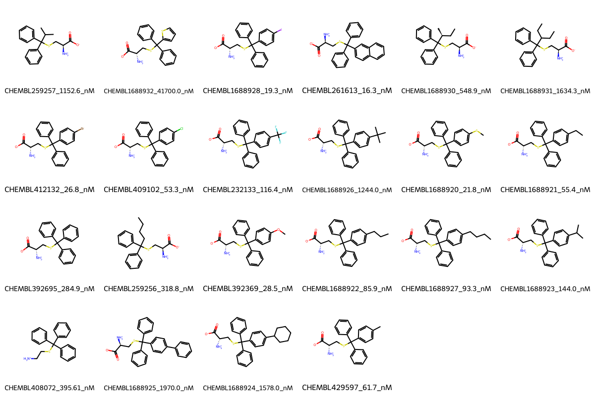

# KIF11 System FEP Calculation Results Analysis

## Introduction

KIF11 (Kinesin Family Member 11), also known as Eg5 or KSP, is a motor protein that plays a crucial role in mitotic spindle assembly and maintenance during cell division. It is responsible for the separation of duplicated centrosomes and the formation of the bipolar mitotic spindle. KIF11 has emerged as an important therapeutic target in cancer treatment due to its essential role in cell division and its overexpression in various types of cancer.

## Molecules

The KIF11 system dataset in this study consists of 19 compounds, featuring a core structure with a triphenyl scaffold. The compounds share a common cysteine-derived amino acid moiety and demonstrate structural diversity through various substituents on one of the phenyl rings, including halogens (Cl, Br, I), alkyl groups, and other functionalities. These molecules also show variation in their alkyl chain length and branching patterns.

The experimentally determined binding affinities range from 16.3 nM to 41700 nM, spanning approximately three orders of magnitude, with binding free energies from -5.97 to -10.62 kcal/mol.

## Conclusions

The FEP calculation results for the KIF11 system show moderate correlation with experimental data, achieving an R² of 0.58 and an RMSE of 1.10 kcal/mol. Several compounds demonstrated good prediction accuracy, such as CHEMBL408072 (experimental: -8.73 kcal/mol, predicted: -8.52 kcal/mol) and CHEMBL392695 (experimental: -8.92 kcal/mol, predicted: -8.40 kcal/mol). The predicted binding free energies ranged from -6.03 to -12.39 kcal/mol, showing some systematic overestimation of binding strength for the most potent compounds.

## References

For more information about the KIF11 target and associated bioactivity data, please visit:
https://www.ebi.ac.uk/chembl/explore/assay/CHEMBL1694081 