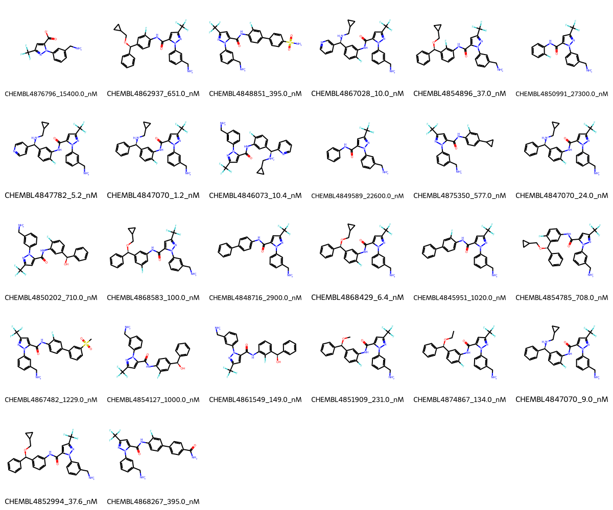

# KLK3 System FEP Calculation Results Analysis

> This README is generated by AI model using verified experimental data and Uni-FEP calculation results. Content may contain inaccuracies and is provided for reference only. No liability is assumed for outcomes related to its use.

## Introduction

KLK3 (Kallikrein-3), also known as Prostate-Specific Antigen (PSA), is a serine protease that plays a crucial role in the liquefaction of seminal fluid. It is primarily produced by the prostate gland and has been widely used as a biomarker for prostate cancer diagnosis and monitoring. Beyond its diagnostic value, KLK3 has emerged as a potential therapeutic target, as its inhibition may help in treating prostate cancer and other prostate-related conditions. The development of selective KLK3 inhibitors is an active area of research in drug discovery.

## Molecules

The KLK3 system dataset in this study comprises 26 compounds, featuring a trifluoromethyl-pyrazole core structure linked to various substituted phenyl rings. These compounds exhibit structural diversity through different substituents, including cyclopropyl ethers, fluorine atoms, and aminomethyl groups. A notable feature is the presence of a basic aminomethyl group that appears to be important for binding affinity.

The experimentally determined binding affinities range from 1.2 nM to 27300 nM, spanning approximately four orders of magnitude, with binding free energies from -6.22 to -12.16 kcal/mol.

## Conclusions

The FEP calculation results for the KLK3 system show moderate predictive performance with an R² of 0.61 and an RMSE of 1.01 kcal/mol. The predicted binding free energies (-3.86 to -11.13 kcal/mol) generally correlate with experimental values, though with some notable deviations. Several compounds showed good prediction accuracy, such as CHEMBL4847070 (experimental: -10.97 kcal/mol, predicted: -11.13 kcal/mol) and CHEMBL4868267 (experimental: -8.73 kcal/mol, predicted: -8.73 kcal/mol). The most potent compound, CHEMBL4847070, with an experimental binding free energy of -12.16 kcal/mol, was predicted at -11.09 kcal/mol.

## References

For more information about the KLK3 target and associated bioactivity data, please visit:
https://www.ebi.ac.uk/chembl/explore/assay/CHEMBL4844448 