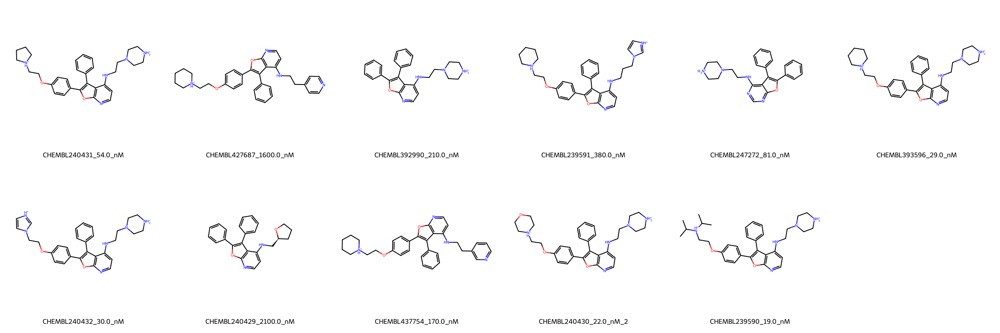

# LCK System FEP Calculation Results Analysis

## Introduction

LCK (Lymphocyte-specific protein tyrosine kinase) is a non-receptor tyrosine kinase that plays a crucial role in T-cell receptor signaling and T-cell development. It is primarily expressed in T lymphocytes and is essential for normal T-cell function and development. LCK has emerged as an important therapeutic target for autoimmune diseases, transplant rejection, and certain types of cancer, particularly T-cell lymphomas, due to its central role in T-cell signaling.

## Molecules

The LCK system dataset in this study consists of 11 compounds, featuring a core structure with a benzofuro[3,2-d]pyrimidine scaffold. The compounds share a common biphenyl substituent and demonstrate structural diversity through various aminoethyl linkers connected to different cyclic amines, including piperazine, morpholine, and imidazole derivatives. These molecules also show variation in their alkoxy substituents and terminal amine patterns.

The experimentally determined binding affinities range from 19 nM to 2100 nM, spanning approximately two orders of magnitude, with binding free energies from -7.74 to -10.53 kcal/mol.

## Conclusions

The FEP calculation results for the LCK system show excellent correlation with experimental data, achieving an R² of 0.74 and an RMSE of 0.59 kcal/mol. Several compounds demonstrated outstanding prediction accuracy, such as CHEMBL239590 (experimental: -10.53 kcal/mol, predicted: -10.49 kcal/mol) and CHEMBL240430 (experimental: -10.44 kcal/mol, predicted: -10.61 kcal/mol). The predicted binding free energies ranged from -7.35 to -10.87 kcal/mol, showing excellent agreement with the experimental range.

## References

For more information about the LCK target and associated bioactivity data, please visit:
https://www.ebi.ac.uk/chembl/explore/assay/CHEMBL903614 