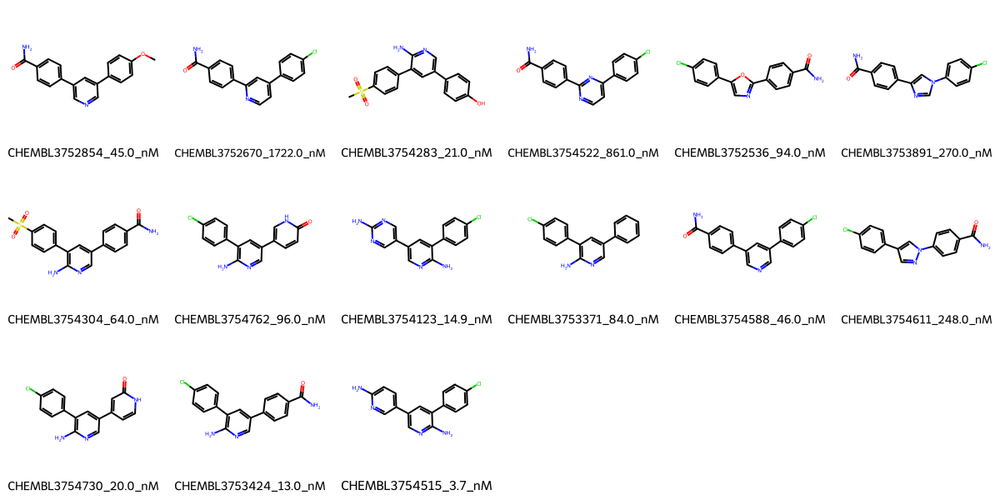

# MAP4K4 System FEP Calculation Results Analysis

## Introduction

MAP4K4 (Mitogen-Activated Protein Kinase Kinase Kinase Kinase 4), also known as HGK or NIK, is a serine/threonine protein kinase that belongs to the STE20/MAP4K family. It plays crucial roles in various cellular processes, including inflammation, cell migration, and metabolic regulation. MAP4K4 has emerged as an important therapeutic target, particularly in inflammatory diseases, cancer, and metabolic disorders. The enzyme's involvement in multiple signaling pathways and its association with various pathological conditions makes it an attractive target for drug development.

## Molecules

The MAP4K4 system dataset in this study comprises 15 compounds, featuring a biaryl scaffold with various heterocyclic cores. These compounds demonstrate structural diversity through different modifications, including pyridine, pyrimidine, and oxazole rings, connected to substituted phenyl groups. Notable features include the presence of primary amides, chloro substituents, and various hydrogen bond donors and acceptors that appear to be important for binding affinity.

The experimentally determined binding affinities range from 3.7 nM to 1722.0 nM, spanning approximately three orders of magnitude, with binding free energies from -7.86 to -11.50 kcal/mol.

## Conclusions

The FEP calculation results for the MAP4K4 system demonstrate good predictive performance with an R² of 0.75 and an RMSE of 0.53 kcal/mol. The predicted binding free energies (-7.68 to -11.39 kcal/mol) show strong correlation with experimental values. Several compounds showed excellent prediction accuracy, such as CHEMBL3753424 (experimental: -10.75 kcal/mol, predicted: -10.63 kcal/mol) and CHEMBL3754515 (experimental: -11.50 kcal/mol, predicted: -11.39 kcal/mol). The most potent compound, CHEMBL3754515, with an experimental binding free energy of -11.50 kcal/mol, was particularly well predicted at -11.39 kcal/mol.

## References

For more information about the MAP4K4 target and associated bioactivity data, please visit:
https://www.ebi.ac.uk/chembl/explore/assay/CHEMBL3755426 