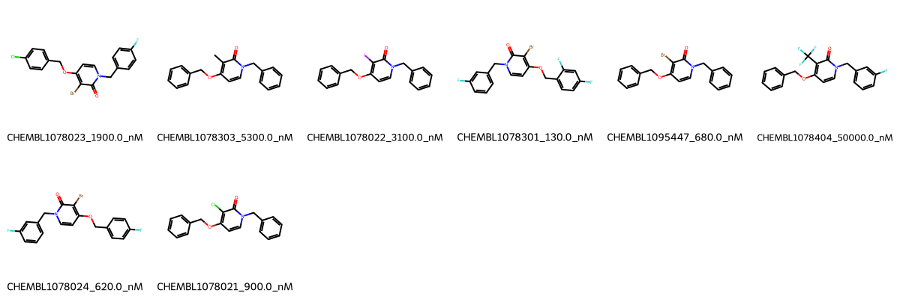

# MAPK14 System FEP Calculation Results Analysis

## Target Introduction

MAPK14 (Mitogen-Activated Protein Kinase 14), also known as p38α, is a serine/threonine protein kinase that plays a crucial role in cellular responses to stress, inflammation, and other environmental signals. It is a key mediator of inflammatory cytokine production and cellular responses to stress stimuli. MAPK14 has emerged as an important therapeutic target for inflammatory diseases, autoimmune disorders, and certain types of cancer.

## Dataset Analysis

The MAPK14 system dataset in this study consists of 8 compounds, featuring a core structure with a pyridin-2(1H)-one scaffold. The compounds share a common benzyl group at the N1 position and demonstrate structural diversity through various substituents at the C5 position, including halogens (Cl, Br, I), trifluoromethyl groups, and methyl groups. These molecules also show variation in their phenoxy substituents at the C4 position, with different fluorine substitution patterns.

The experimentally determined binding affinities range from 130 nM to 50000 nM, spanning approximately three orders of magnitude, with binding free energies from -5.86 to -9.39 kcal/mol.

## Conclusions

The FEP calculation results for the MAPK14 system show good correlation with experimental data, achieving an R² of 0.66 and an RMSE of 0.65 kcal/mol. Several compounds demonstrated excellent prediction accuracy, such as CHEMBL1078021 (experimental: -8.24 kcal/mol, predicted: -8.02 kcal/mol) and CHEMBL1078024 (experimental: -8.46 kcal/mol, predicted: -8.81 kcal/mol). The predicted binding free energies ranged from -5.44 to -9.04 kcal/mol, showing good agreement with the experimental range.

## References

For more information about the MAPK14 target and associated bioactivity data, please visit:
https://www.ebi.ac.uk/chembl/explore/assay/CHEMBL1101788 