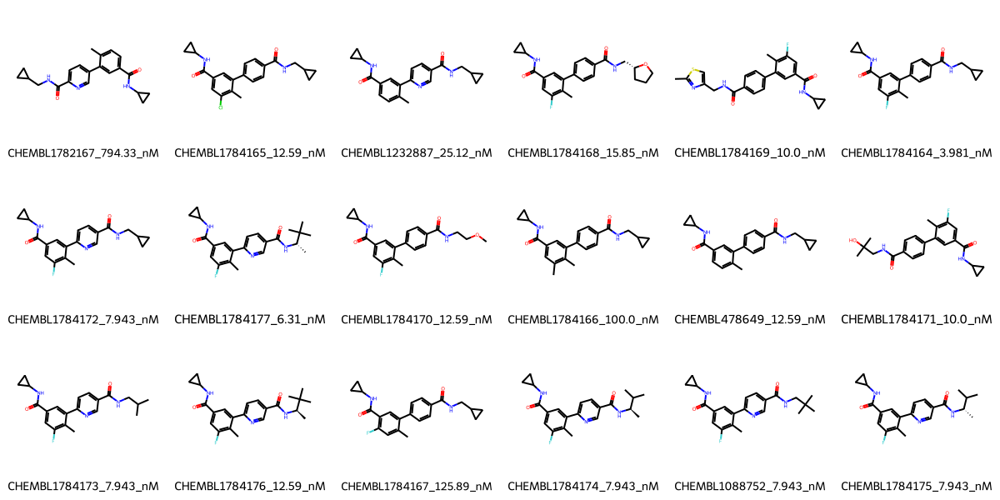

# MAPK14 System FEP Calculation Results Analysis

## Target Introduction

MAPK14 (Mitogen-Activated Protein Kinase 14), also known as p38α, is a serine/threonine protein kinase that plays a crucial role in cellular responses to stress, inflammation, and other environmental signals. It is a key mediator of inflammatory cytokine production and cellular responses to stress stimuli. MAPK14 has emerged as an important therapeutic target for inflammatory diseases, autoimmune disorders, and certain types of cancer.

## Dataset Analysis

The MAPK14 system dataset in this study consists of 18 compounds, featuring a core structure with a biphenyl scaffold. The compounds share a common cyclopropanecarboxamide substituent and demonstrate structural diversity through various modifications, including fluorine, chlorine, and methyl substituents on the biphenyl core. These molecules also show variation in their terminal amide substituents, incorporating different cyclic and branched aliphatic groups.

The experimentally determined binding affinities range from 3.98 nM to 794.33 nM, spanning approximately two orders of magnitude, with binding free energies from -8.32 to -11.45 kcal/mol.

## Conclusions

The FEP calculation results for the MAPK14 system show good correlation with experimental data, achieving an R² of 0.70 and an RMSE of 1.30 kcal/mol. Several compounds demonstrated excellent prediction accuracy, such as CHEMBL1088752 (experimental: -11.04 kcal/mol, predicted: -10.83 kcal/mol) and CHEMBL1784175 (experimental: -11.04 kcal/mol, predicted: -10.90 kcal/mol). The predicted binding free energies ranged from -4.06 to -12.58 kcal/mol, generally capturing the relative binding trends of the series despite some outliers.

## References

For more information about the MAPK14 target and associated bioactivity data, please visit:
https://www.ebi.ac.uk/chembl/explore/assay/CHEMBL1787752 