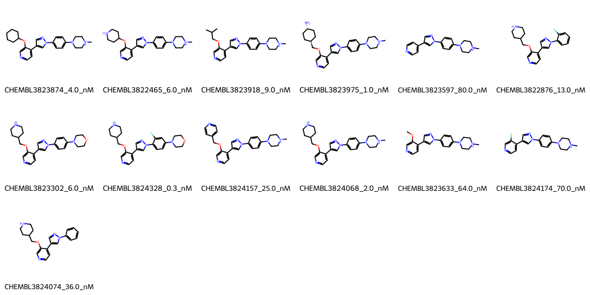

# MELK System FEP Calculation Results Analysis

> This README is generated by AI model using verified experimental data and Uni-FEP calculation results. Content may contain inaccuracies and is provided for reference only. No liability is assumed for outcomes related to its use.

## Introduction

MELK (Maternal Embryonic Leucine Zipper Kinase) is a serine/threonine protein kinase that plays important roles in cell cycle regulation, cell proliferation, and stem cell self-renewal. It is highly expressed during early embryonic development and in various cancer types. MELK has emerged as an important therapeutic target in cancer treatment, particularly in aggressive cancers with poor prognosis, due to its role in cell cycle regulation and cancer cell survival.

## Molecules

The MELK system dataset in this study consists of 13 compounds, featuring a core structure with a pyridine-pyrazole scaffold. The compounds share a common N-methylpiperazine substituent and demonstrate structural diversity through various alkoxy substituents at the pyridine C5 position, including cyclopentyl, cyclohexyl, and branched alkyl groups. These molecules also show variation in their terminal aromatic substituents and fluorination patterns.

The experimentally determined binding affinities range from 0.3 nM to 80 nM, spanning approximately two orders of magnitude, with binding free energies from -9.68 to -12.99 kcal/mol.

## Conclusions

The FEP calculation results for the MELK system show moderate correlation with experimental data, achieving an R² of 0.57 and an RMSE of 0.91 kcal/mol. Several compounds demonstrated excellent prediction accuracy, such as CHEMBL3824328 (experimental: -12.99 kcal/mol, predicted: -13.48 kcal/mol) and CHEMBL3824074 (experimental: -10.15 kcal/mol, predicted: -10.33 kcal/mol). The predicted binding free energies ranged from -9.52 to -13.49 kcal/mol, showing good agreement with the experimental range despite some systematic overestimation for the most potent compounds.

## References

For more information about the MELK target and associated bioactivity data, please visit:
https://www.ebi.ac.uk/chembl/explore/assay/CHEMBL3824963 