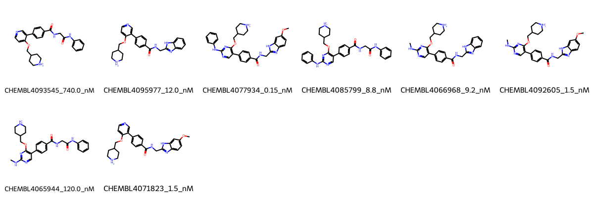

# MELK System FEP Calculation Results Analysis

## Introduction

MELK (Maternal Embryonic Leucine Zipper Kinase) is a serine/threonine protein kinase that plays important roles in cell cycle regulation, cell proliferation, and stem cell self-renewal. It is frequently overexpressed in various types of cancer and has been associated with poor prognosis in several malignancies. MELK has emerged as a promising therapeutic target in oncology, particularly in aggressive cancers with limited treatment options. The development of selective MELK inhibitors represents an important approach in cancer therapy.

## Molecules

The MELK system dataset in this study comprises 8 compounds, featuring a pyridine-based scaffold with various substituents. These compounds demonstrate structural diversity through different modifications, including benzimidazole rings, amide linkages, and pyrrolidine-based side chains. A notable feature is the presence of a basic pyrrolidine group that appears to be conserved across the series and important for binding affinity.

The experimentally determined binding affinities range from 0.15 nM to 740.0 nM, spanning approximately four orders of magnitude, with binding free energies from -8.36 to -13.40 kcal/mol.

## Conclusions

The FEP calculation results for the MELK system demonstrate good predictive performance with an R² of 0.72 and an RMSE of 0.79 kcal/mol. The predicted binding free energies (-9.26 to -12.66 kcal/mol) show good correlation with experimental values. Several compounds showed excellent prediction accuracy, such as CHEMBL4071823 (experimental: -12.03 kcal/mol, predicted: -12.12 kcal/mol) and CHEMBL4065944 (experimental: -9.44 kcal/mol, predicted: -9.26 kcal/mol). The most potent compound, CHEMBL4077934, with an experimental binding free energy of -13.40 kcal/mol, was predicted at -12.66 kcal/mol.

## References

For more information about the MELK target and associated bioactivity data, please visit:
https://www.ebi.ac.uk/chembl/explore/assay/CHEMBL4006633 