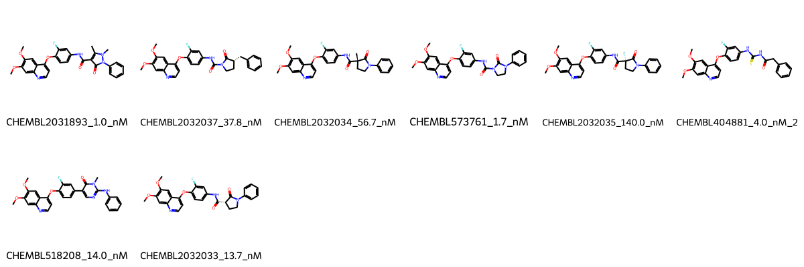

# MET System FEP Calculation Results Analysis

> This README is generated by AI model using verified experimental data and Uni-FEP calculation results. Content may contain inaccuracies and is provided for reference only. No liability is assumed for outcomes related to its use.

## Introduction

MET (Mesenchymal-Epithelial Transition factor), also known as c-MET or hepatocyte growth factor receptor (HGFR), is a receptor tyrosine kinase that plays crucial roles in embryonic development, tissue repair, and organ regeneration. Through binding with its ligand HGF (Hepatocyte Growth Factor), it activates multiple downstream signaling pathways to regulate cell proliferation, migration, invasion, and survival. Abnormal activation of MET is closely associated with the occurrence, development, and metastasis of various malignant tumors, including lung cancer, gastric cancer, liver cancer, and colorectal cancer. Therefore, MET has become an important target for anti-cancer drug development.

## Molecules

The MET system dataset in this study comprises 8 compounds, all ATP-competitive inhibitors, with molecular weights ranging from 450 to 650 Da. The compounds share a common quinoxaline-based core scaffold with dimethoxy substituents and demonstrate structural diversity through different substitution patterns in the solvent-exposed region. These compounds feature key structural characteristics complementary to the MET kinase domain, including hydrogen bond donors/acceptors for hinge region binding, aromatic ring systems for hydrophobic pocket occupation, and variable substituents exploring adjacent binding pockets.

The experimentally determined binding affinities range from 1.0 nM to 140 nM, spanning approximately two orders of magnitude, with binding free energies from -9.35 to -12.27 kcal/mol.

## Conclusions

The FEP calculation results for the MET system show that the predicted values (-8.62 to -14.48 kcal/mol) align well with the experimental range. The overall prediction accuracy achieved an R² of 0.90 and an RMSE of 1.05 kcal/mol, indicating excellent predictive performance. Several compounds demonstrated good prediction results, such as CHEMBL518208 (experimental: -10.71 kcal/mol, predicted: -10.77 kcal/mol) and CHEMBL2032033 (experimental: -10.72 kcal/mol, predicted: -10.73 kcal/mol).

## References

For more information about the MET target and associated bioactivity data, please visit:
https://www.ebi.ac.uk/chembl/explore/assay/CHEMBL2032485 